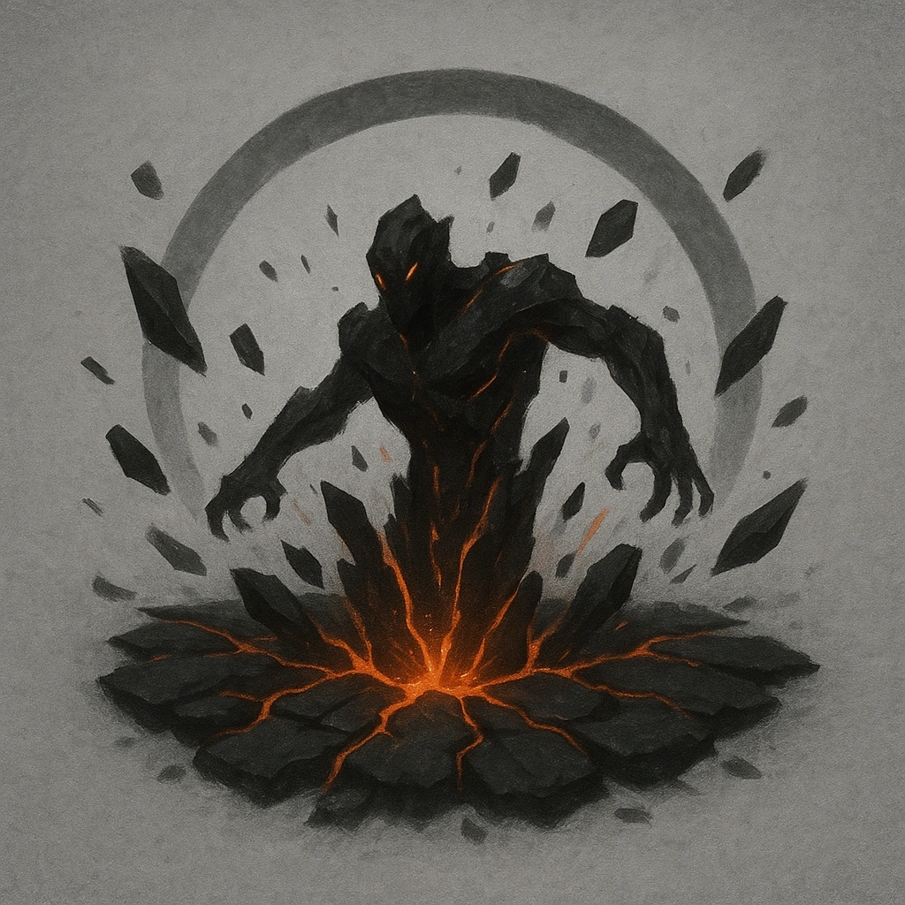

# Earth Eruption

## Description
*
<strong>Mark a Stress</strong> to have the Burrower burst out of the ground. All creatures within Very Close range must succeed on an Agility Reaction Roll or be knocked over, making them Vulnerable until they next act.

@Template[type:emanation|range:vc]
*

## Actions
- 
**Roll Save** *vc]*

---

adversaries-features/Solo
 
**UUID:** `Compendium.cybermancy.system.earth-eruption`

