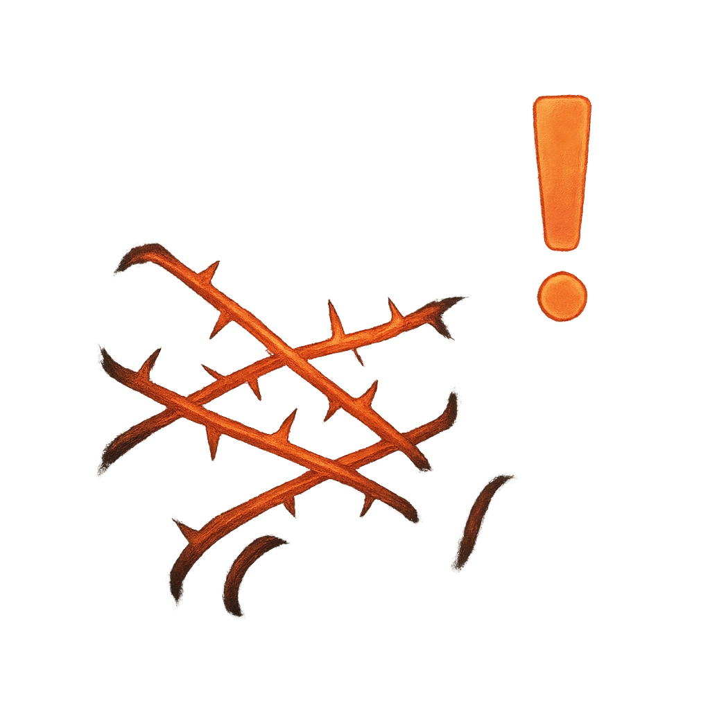

# Encumber

## Description
*
When the Swarm succeeds on an attack, give the target a bramble token. If a target has any bramble tokens, they are Restrained. If a target has 3 or more bramble tokens, they are also Vulnerable. All bramble tokens can be removed by succeeding on a Finesse Roll (12 + the number of bramble tokens) or dealing Major or greater damage to the Swarm. If bramble tokens are removed from a target using a Finesse Roll, a number of Tangle Bramble Minions spawn within Melee range equal to the number of tokens removed.
*

## Actions
- 
**Give Token** *When the Swarm succeeds on an attack, give the target a bramble token. If a target has any bramble tokens, they are Restrained. If a target has 3 or more bramble tokens, they are also Vulnerable. All bramble tokens can be removed by succeeding on a Finesse Roll (12 + the number of bramble tokens) or dealing Major or greater damage to the Swarm. If bramble tokens are removed from a target using a Finesse Roll, a number of Tangle Bramble Minions spawn within Melee range equal to the number of tokens removed.*

---

adversaries-features/Horde
 
**UUID:** `Compendium.cybermancy.system.encumber`

