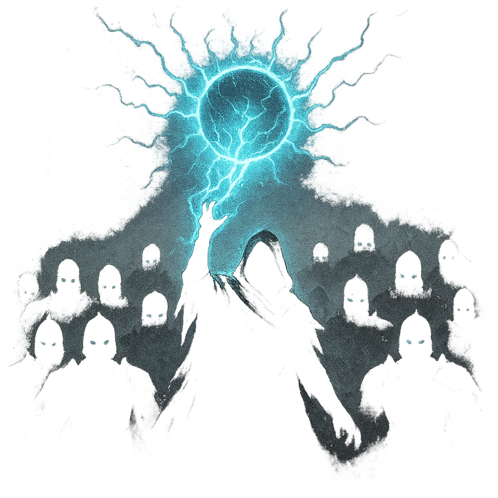

# Endless Legions

## Description
*
<strong>Spend a Fear</strong> to summon a number of @UUID[Compendium.daggerheart.adversaries.Actor.OsLG2BjaEdTZUJU9]{Fallen Shock Troops} equal to twice the number of PCs. The Shock Troops appear at Far range.
*

## Actions
- 
**Spend Fear** *Spend a Fear to summon a number of @UUID[Compendium.daggerheart.adversaries.Actor.OsLG2BjaEdTZUJU9]{Fallen Shock Troops} equal to twice the number of PCs. The Shock Troops appear at Far range.*

---

adversaries-features/Solo
 
**UUID:** `Compendium.cybermancy.system.endless-legions`

