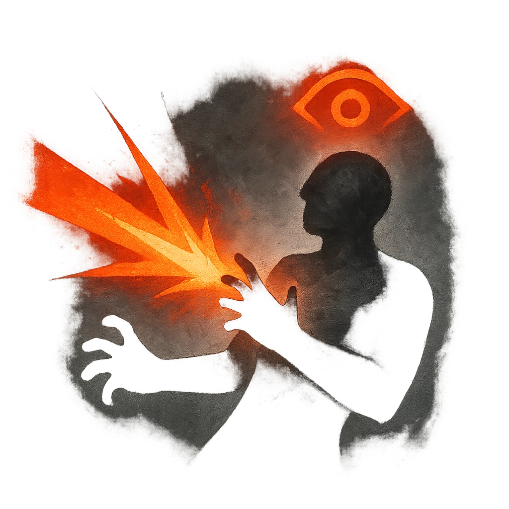

# Enervating Blast

## Description
*
<strong>Spend a Fear</strong> to make a standard attack against a target within range. On a success, the target must mark a Stress.
*

## Actions
- 
**Attack** *Spend a Fear to make a standard attack against a target within range. On a success, the target must mark a Stress.*

---

adversaries-features/Support
 
**UUID:** `Compendium.cybermancy.system.enervating-blast`

