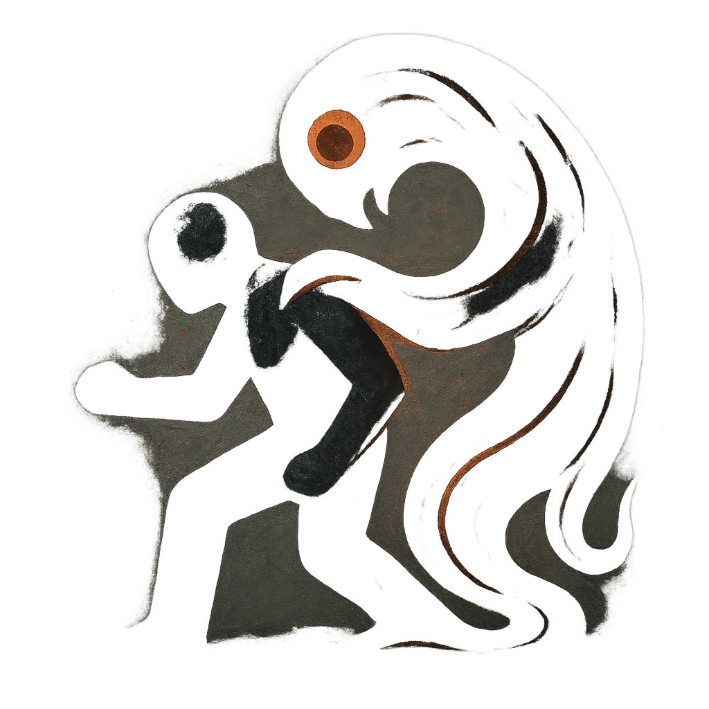

# Envelop

## Description
*
Make an attack against a target within Melee range. On a success, the Ooze Envelops them and the target must mark 2 Stress. While Enveloped, the target must mark an additional Stress every time they make an action roll. When the Ooze takes Severe damage, all Enveloped targets are freed and the condition is cleared.
*

## Actions
- 
**Attack** **

---

adversaries-features/Skulk
 
**UUID:** `Compendium.cybermancy.system.envelop`

