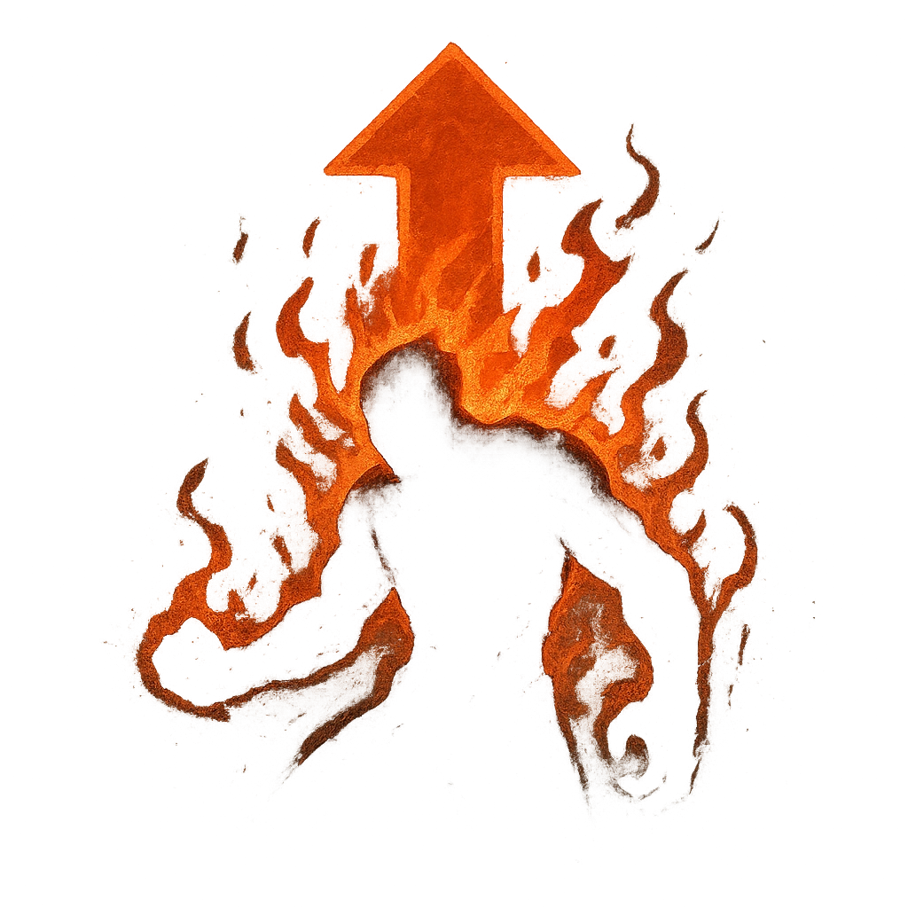

# Erupting Rage

## Description
*
When the Obsidian Predator marks their last HP, replace them with the @UUID[Compendium.daggerheart.adversaries.Actor.eArAPuB38CNR0ZIM]{Molten Scourge} and immediately spotlight them.
*

## Actions
—

---

adversaries-features/Solo
 
**UUID:** `Compendium.cybermancy.system.erupting-rage`

