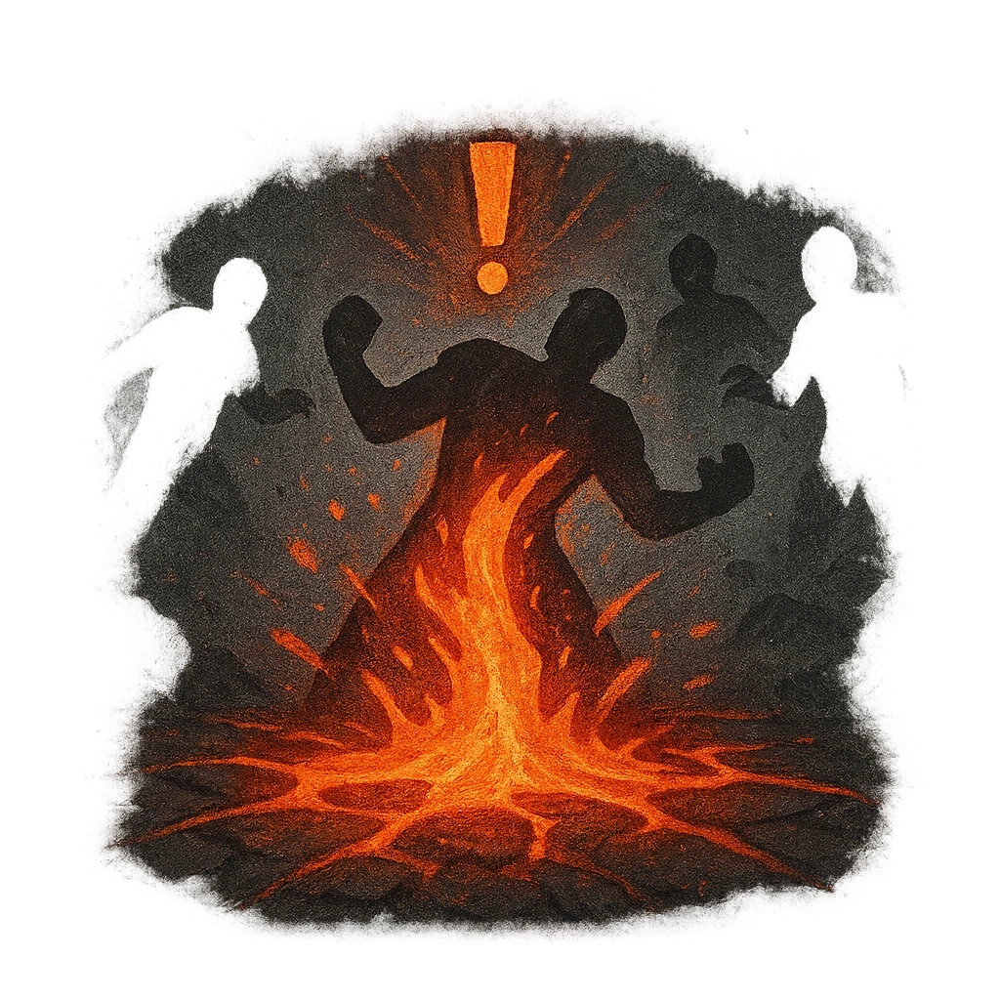

# Eruption

## Description
*
<strong>Spend a Fear</strong> and choose a point within Far range. A Very Close area around that point erupts into impassable terrain. All targets within that area must make an Agility Reaction Roll (14). Targets who fail take <strong>2d10</strong> physical damage and are thrown out of the area. Targets who succeed take half damage and aren’t moved.

@Template[type:circle|range:vc]
*

## Actions
- 
**Roll Save** *vc]*

---

adversaries-features/Ranged
 
**UUID:** `Compendium.cybermancy.system.eruption`

