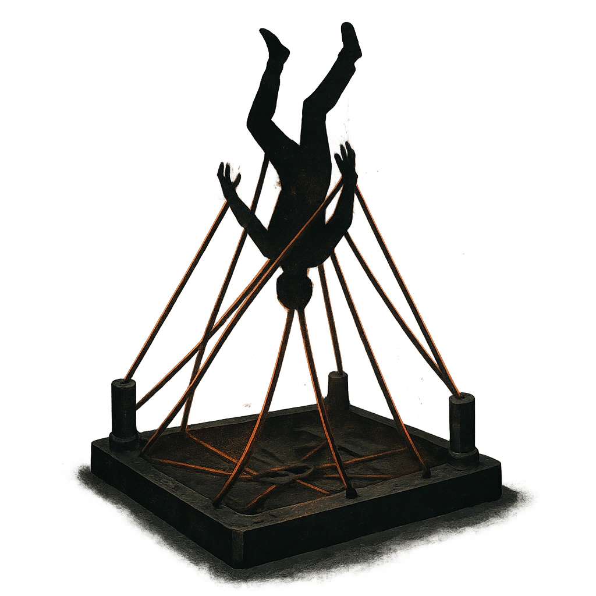

# Escape Plan

## Description
*
<strong>Mark a Stress</strong> to reveal a snare trap set anywhere on the battlefi eld by the Thief. All targets within Very Close range of the trap must succeed on an Agility Reaction Roll (13) or be pulled off  their feet and suspended upside down. A target is Restrained and Vulnerable until they break free, ending both conditions, with a successful Finesse or Strength Roll (13).

@Template[type:rect|range:c]
*

## Actions
- 
**Roll Save** *c]*

---

adversaries-features/Skulk
 
**UUID:** `Compendium.cybermancy.system.escape-plan`

