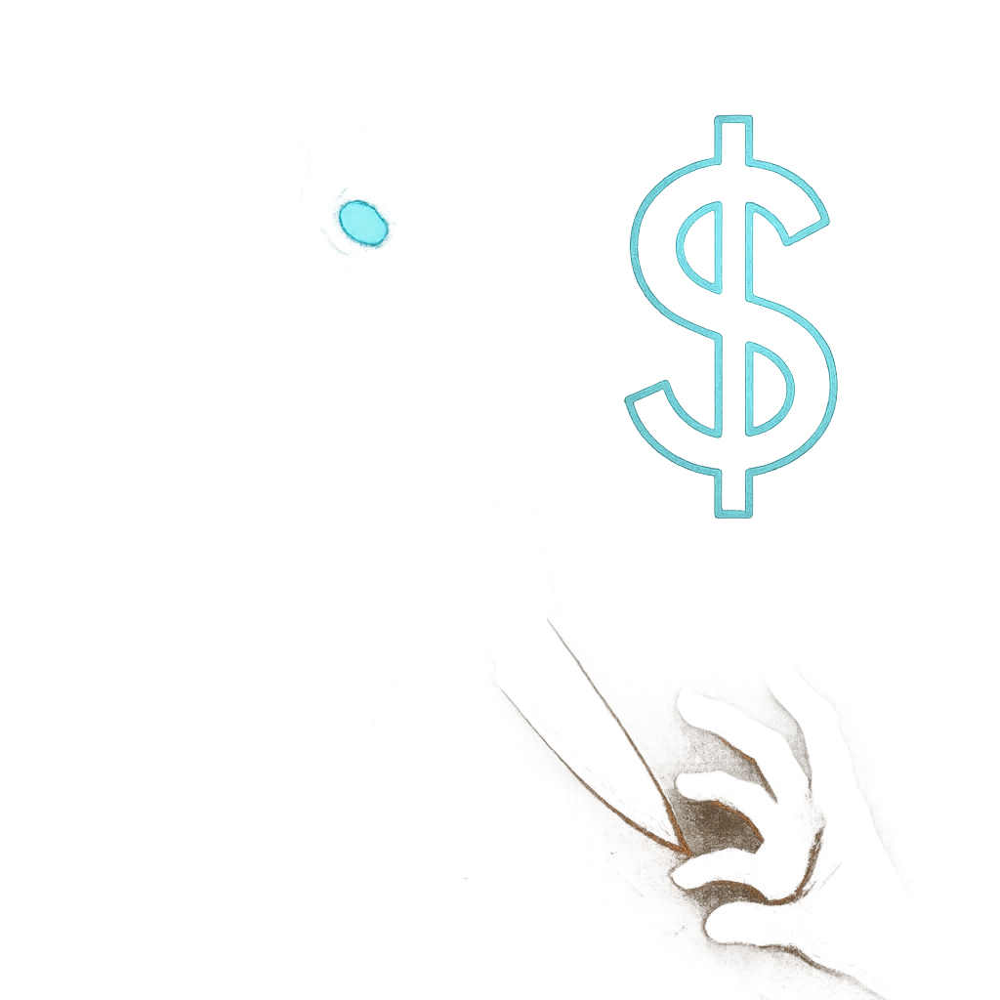

# Everyone Has a Price

## Description
*
<strong>Spend a Fear</strong> to offer a target a dangerous bargain for something they want or need. If used on a PC, they must make a Presence Reaction Roll (17). On a failure, they must mark 2 Stress or take the deal.
*

## Actions
- 
**Roll Save** *Spend a Fear to offer a target a dangerous bargain for something they want or need. If used on a PC, they must make a Presence Reaction Roll (17). On a failure, they must mark 2 Stress or take the deal.*

---

adversaries-features/Social
 
**UUID:** `Compendium.cybermancy.system.everyone-has-a-price`

