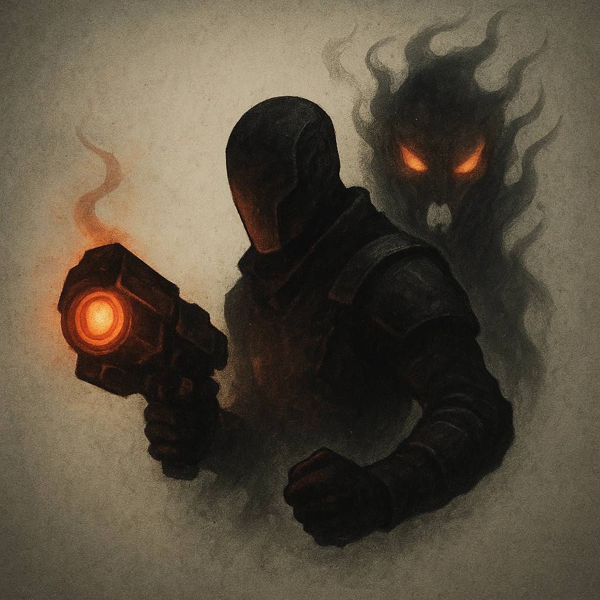

# Execute Them

## Description
*
<strong>Spend a Fear</strong> per PC in the party to have the group condemned for crimes real or imagined. A PC who succeeds on a Presence Roll can demand trial by combat or another special form of trial.
*

## Actions
—

---

adversaries-features/Social
 
**UUID:** `Compendium.cybermancy.system.execute-them`

