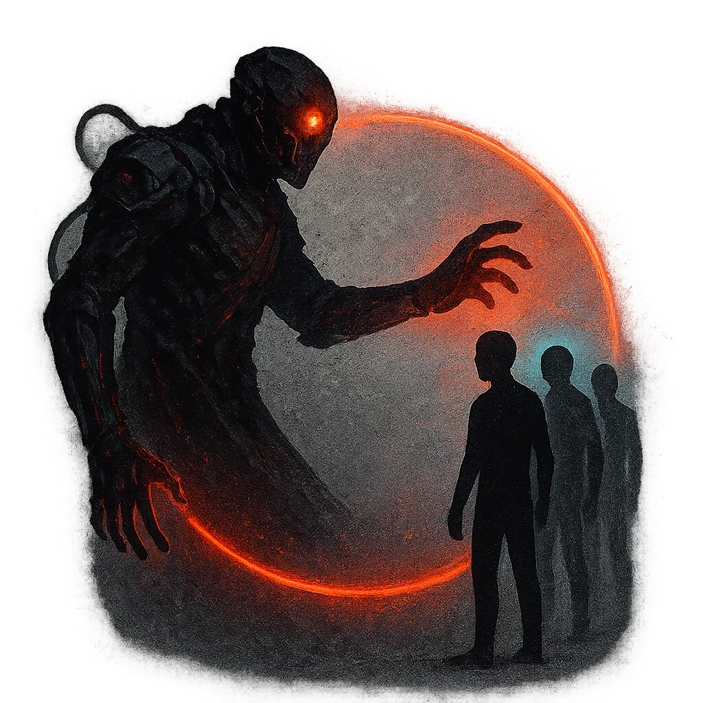

# Exile

## Description
*
<strong>Spend a Fear</strong> and target a PC. The Noble proclaims that the target and their allies are exiled from the noble’s territory. While exiled, the target and their allies have disadvantage during social situations within the Noble’s domain.
*

## Actions
- 
**Spend Fear** *Spend a Fear and target a PC. The Noble proclaims that the target and their allies are exiled from the noble’s territory. While exiled, the target and their allies have disadvantage during social situations within the Noble’s domain.*

---

adversaries-features/Social
 
**UUID:** `Compendium.cybermancy.system.exile`

