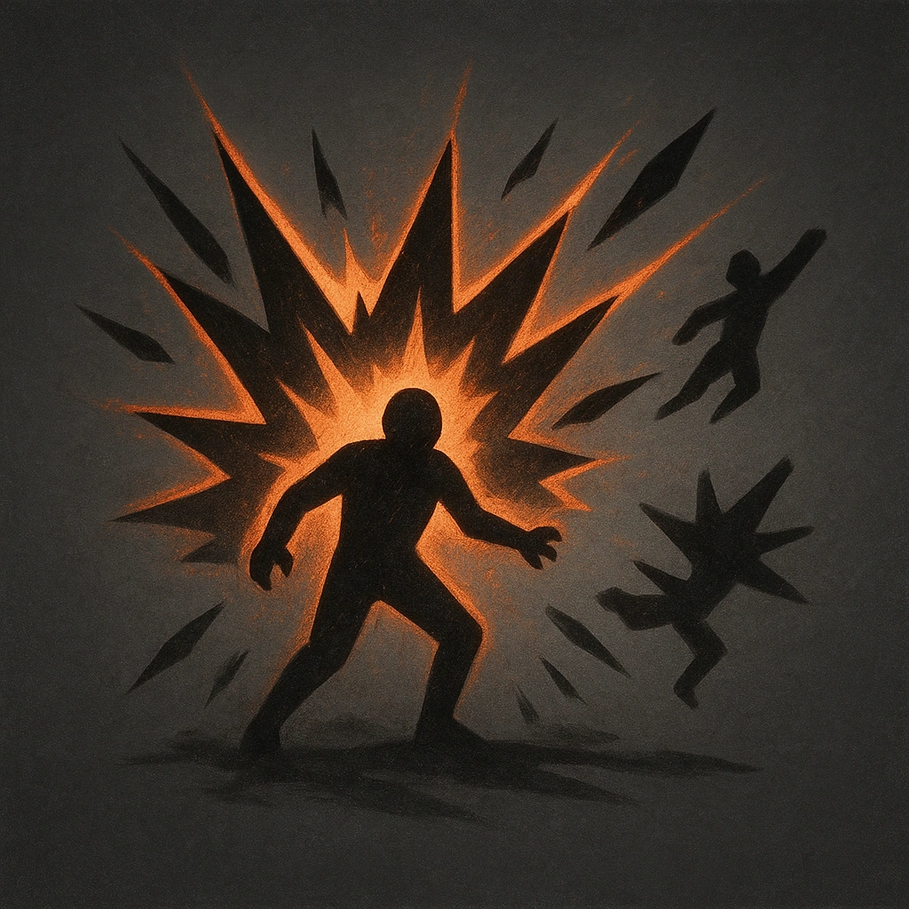

# Explosion

## Description
*
<strong>Spend a Fear</strong> to erupt in a fi ery explosion. Make an attack against all targets within Close range. Targets the Elemental succeeds against take <strong>1d8</strong> magic damage and are knocked back to Far range.

@Template[type:emanation|range:c]
*

## Actions
- 
**Attack** *c]*

---

adversaries-features/Solo
 
**UUID:** `Compendium.cybermancy.system.explosion`

