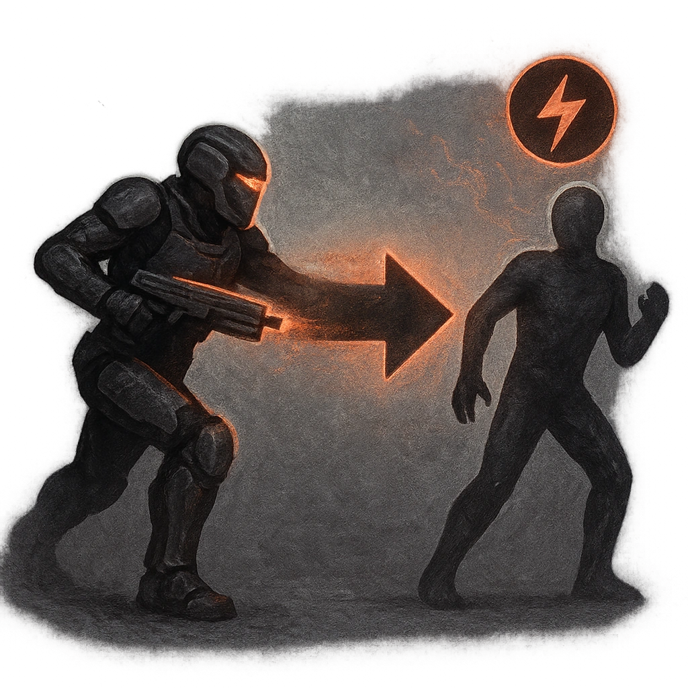

# Fall Back

## Description
*
When a creature moves into Melee range to make an attack, you can <strong>mark a Stress</strong> before the attack roll to move anywhere within Close range and make an attack against that creature. On a success, deal <strong>1d10+2</strong> physical damage.
*

## Actions
- 
**Attack** *When a creature moves into Melee range to make an attack, you can mark a Stress before the attack roll to move anywhere within Close range and make an attack against that creature. On a success, deal 1d10+2 physical damage.*

---

adversaries-features/Standard
 
**UUID:** `Compendium.cybermancy.system.fall-back`

