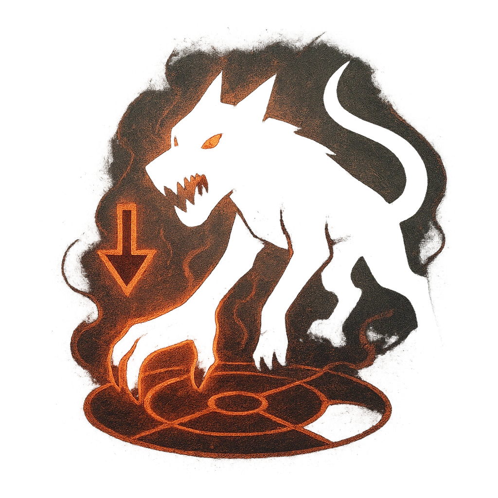

# Fallen Hounds

## Description
*
Once per scene, when the SecretKeeper marks 2 or more HP, you can <strong>mark a Stress</strong> to summon a @UUID[Compendium.daggerheart.adversaries.Actor.NoRZ1PqB8N5wcIw0]{Demonic Hound Pack}, which appears at Close range and is immediately spotlighted.
*

## Actions
- 
**Mark Stress** *Once per scene, when the SecretKeeper marks 2 or more HP, you can mark a Stress to summon a @UUID[Compendium.daggerheart.adversaries.Actor.NoRZ1PqB8N5wcIw0]{Demonic Hound Pack}, which appears at Close range and is immediately spotlighted.*

---

adversaries-features/Leader
 
**UUID:** `Compendium.cybermancy.system.fallen-hounds`

