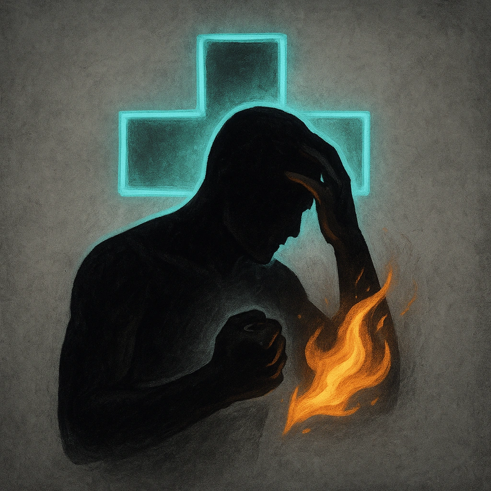

# Fear Is Fuel

## Description
*
 Twice per scene, when a PC rolls a failure with Fear, clear a Stress.
*

## Actions
- 
**Clear Stress** *Twice per scene, when a PC rolls a failure with Fear, clear a Stress.*

---

adversaries-features/Support
 
**UUID:** `Compendium.cybermancy.system.fear-is-fuel`

