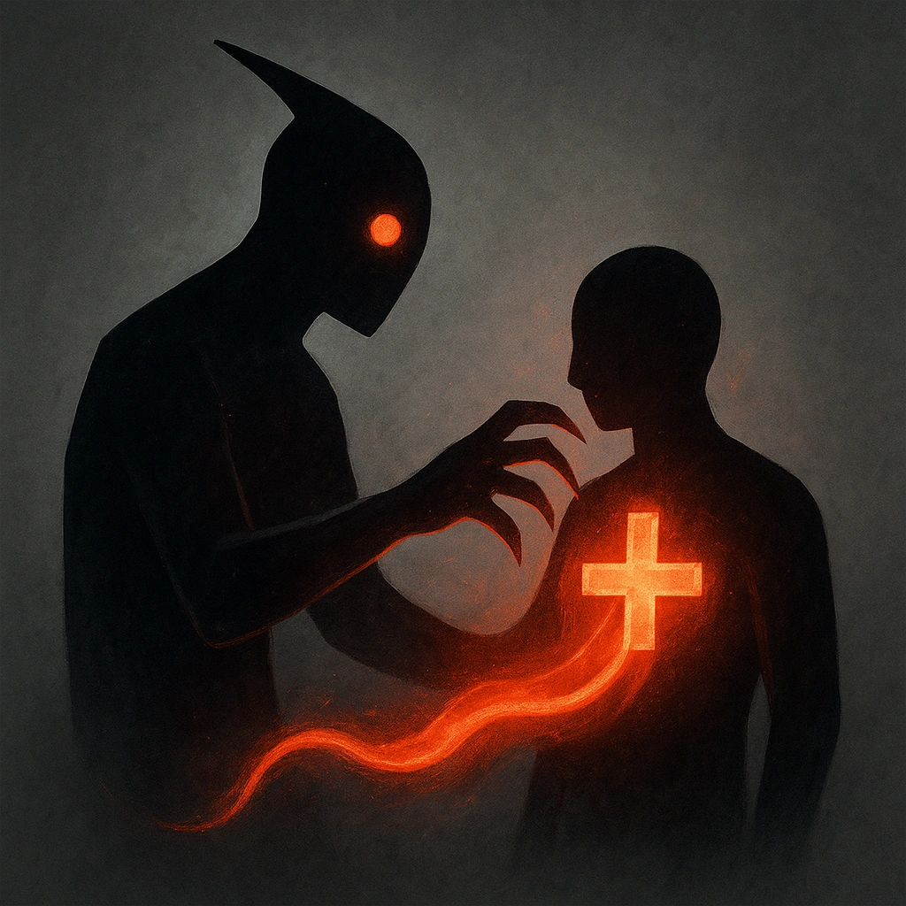

# Feed on Followers

## Description
*
When the Vampire is within Melee range of an ally, they can cause the ally to mark a HP. The Vampire then clears a HP.
*

## Actions
- 
**Clear HP** *When the Vampire is within Melee range of an ally, they can cause the ally to mark a HP. The Vampire then clears a HP.*

---

adversaries-features/Leader
 
**UUID:** `Compendium.cybermancy.system.feed-on-followers`

