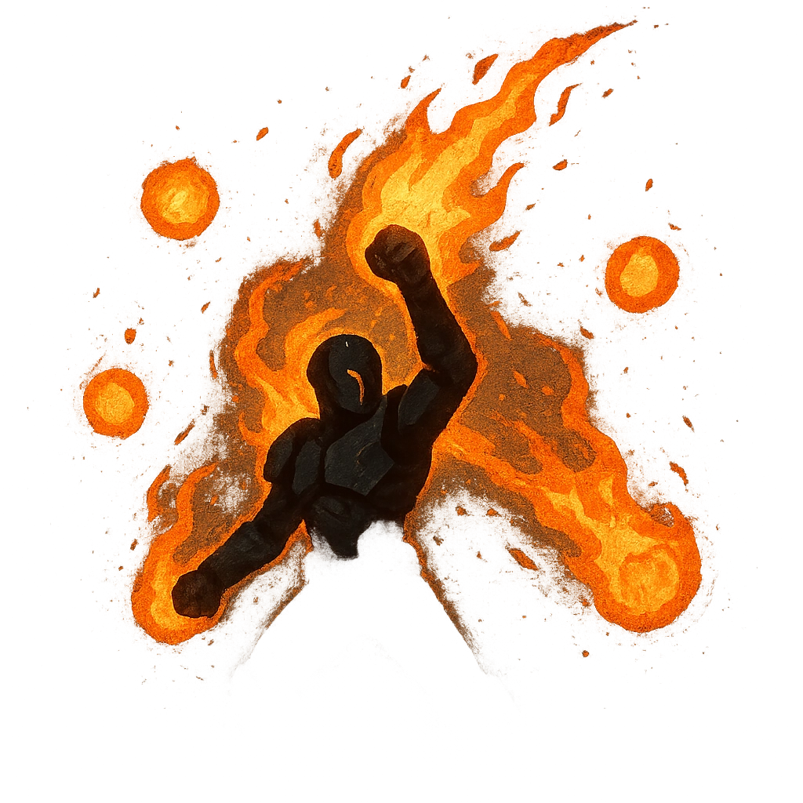

# Fire Jets

## Description
*
The Box shoots into the air, spinning and releasing jets of flame. Make an attack against all targets within Close range. Targets the Box succeeds against take <strong>2d8</strong> physical damage.

@Template[type:emanation|range:c]
*

## Actions
- 
**Attack** *c]*

---

adversaries-features/Solo
 
**UUID:** `Compendium.cybermancy.system.fire-jets`

