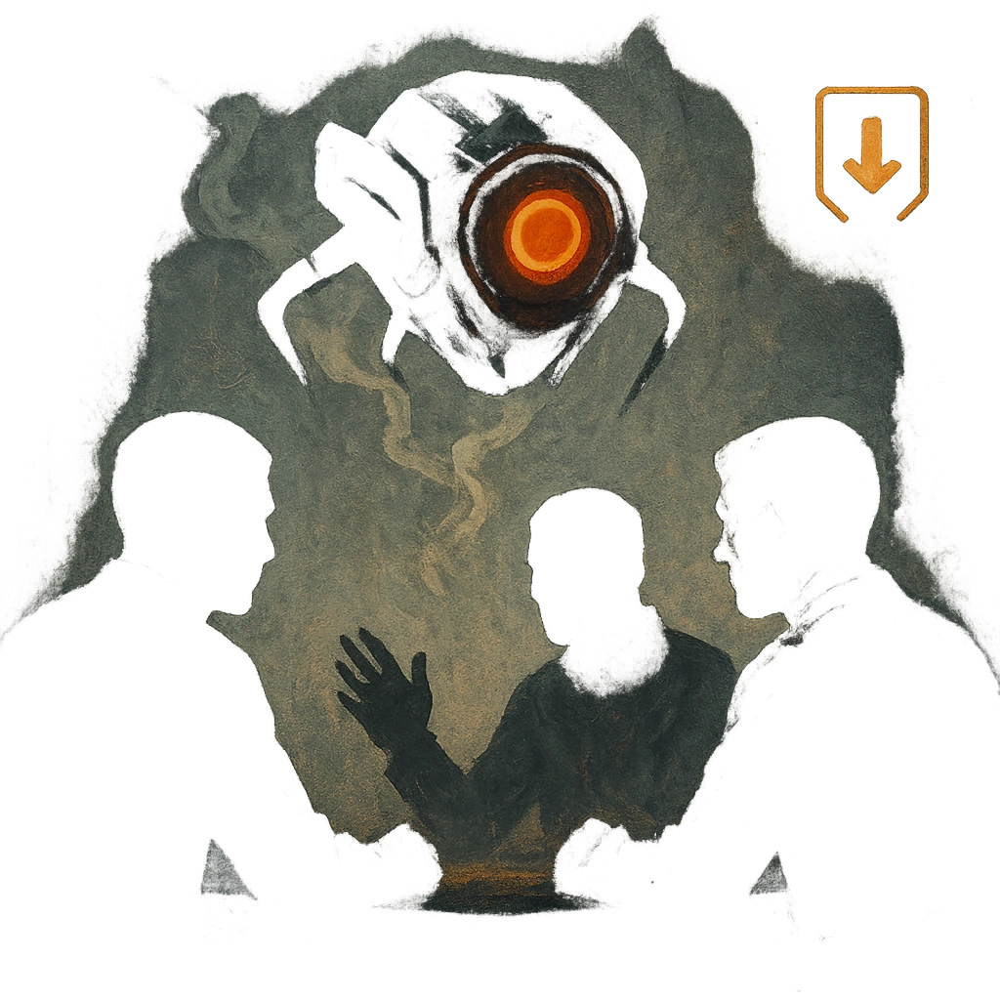

# Fly on the Wall

## Description
*
When a PC or group is discussing something sensitive, you can <strong>mark a Stress</strong> to reveal that the Spy is present in the scene, observing them. If the Spy escapes the scene to report their findings, you gain <strong>1d4</strong> Fear.
*

## Actions
- 
**Mark Stress** *When a PC or group is discussing something sensitive, you can mark a Stress to reveal that the Spy is present in the scene, observing them. If the Spy escapes the scene to report their findings, you gain 1d4 Fear.*

- 
**Gain Fear** *If the Spy escapes the scene to report their findings, you gain 1d4 Fear.*

---

adversaries-features/Social
 
**UUID:** `Compendium.cybermancy.system.fly-on-the-wall`

