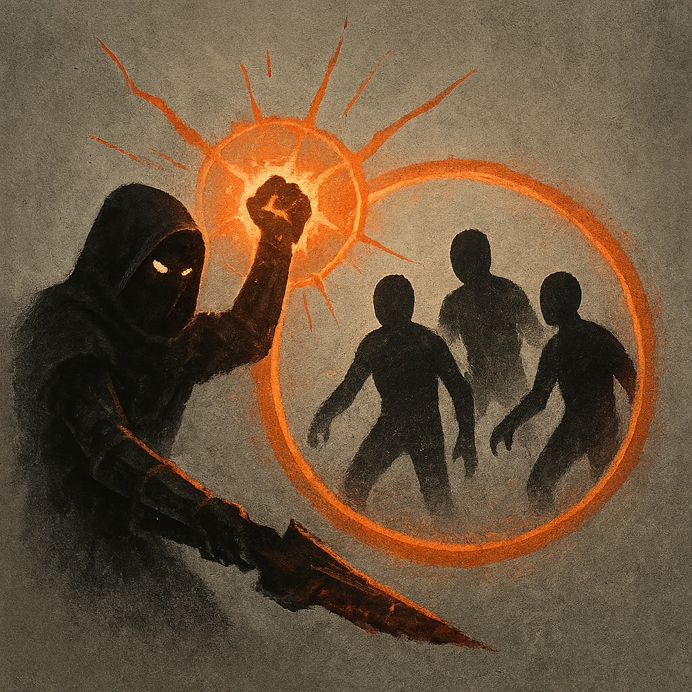

# Focused Volley

## Description
*
<strong>Spend a Fear</strong> to target a point within Far range. Make an attack with advantage against all targets within Close range of that point. Targets the Squadron succeeds against take <strong>1d10+4</strong> physical damage.

@Template[type:circle|range:c]
*

## Actions
- 
**Attack** *c]*

---

adversaries-features/Horde
 
**UUID:** `Compendium.cybermancy.system.focused-volley`

