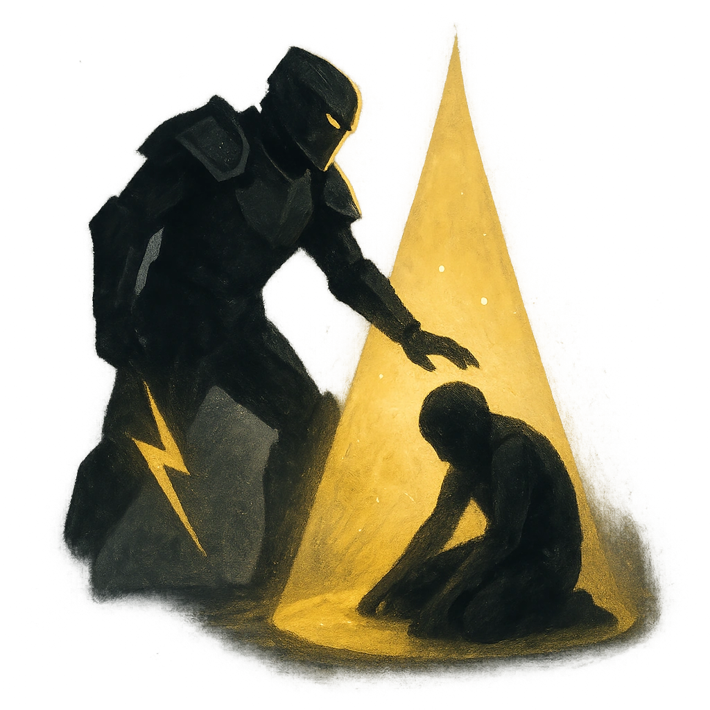

# For the Realm!

## Description
*
<strong>Mark a Stress</strong> to spotlight <strong>[[/r 1d4+1]]</strong> allies. Attacks they make while spotlighted in this way deal half damage.
*

## Actions
- 
**Mark Stress** *Mark a Stress to spotlight [[/r 1d4+1]] allies. Attacks they make while spotlighted in this way deal half damage.*

---

adversaries-features/Leader
 
**UUID:** `Compendium.cybermancy.system.for-the-realm`

