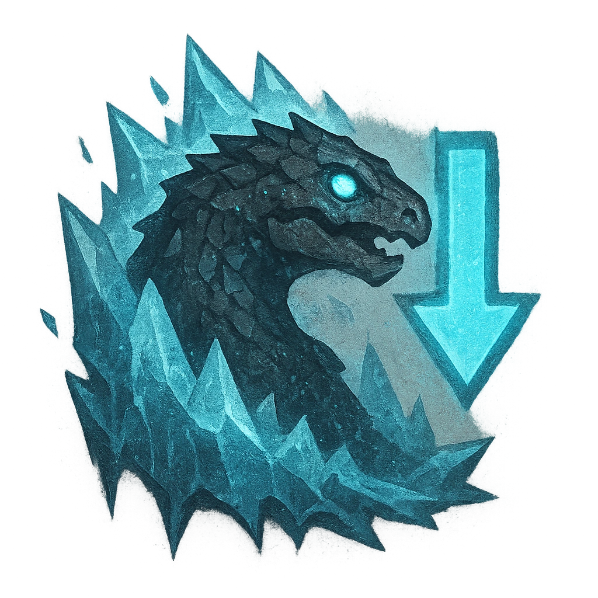

# Frozen Scales

## Description
*
When a creature makes a successful attack against the Dragon from within Very Close range, they must mark a Stress and become Chilled until their next rest or they clear a Stress. While they are Chilled, they have disadvantage on attack rolls.
*

## Actions
- 
**Damage** **

---

adversaries-features/Solo
 
**UUID:** `Compendium.cybermancy.system.frozen-scales`

