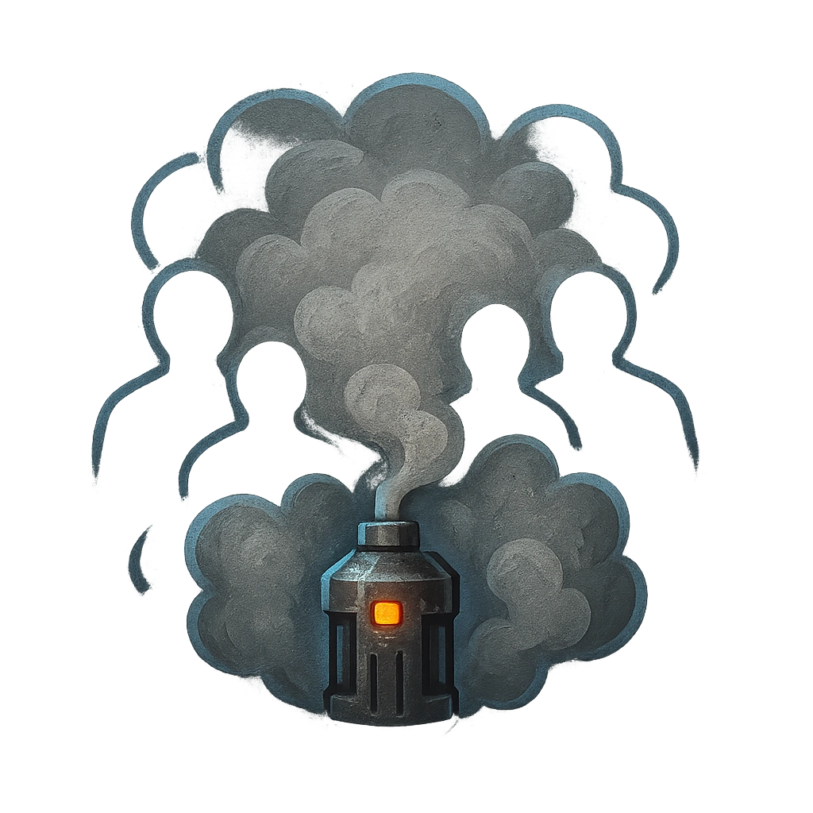

# Fumigation

## Description
*
Drop a smoke bomb that fi lls the air within Close range with smoke, Dizzying all targets in this area. Dizzied targets have disadvantage on their next action roll, then clear the condition.

@Template[type:emanation|range:c]
*

## Actions
- 
**Drop Bomb** *c]*

---

adversaries-features/Skulk
 
**UUID:** `Compendium.cybermancy.system.fumigation`

