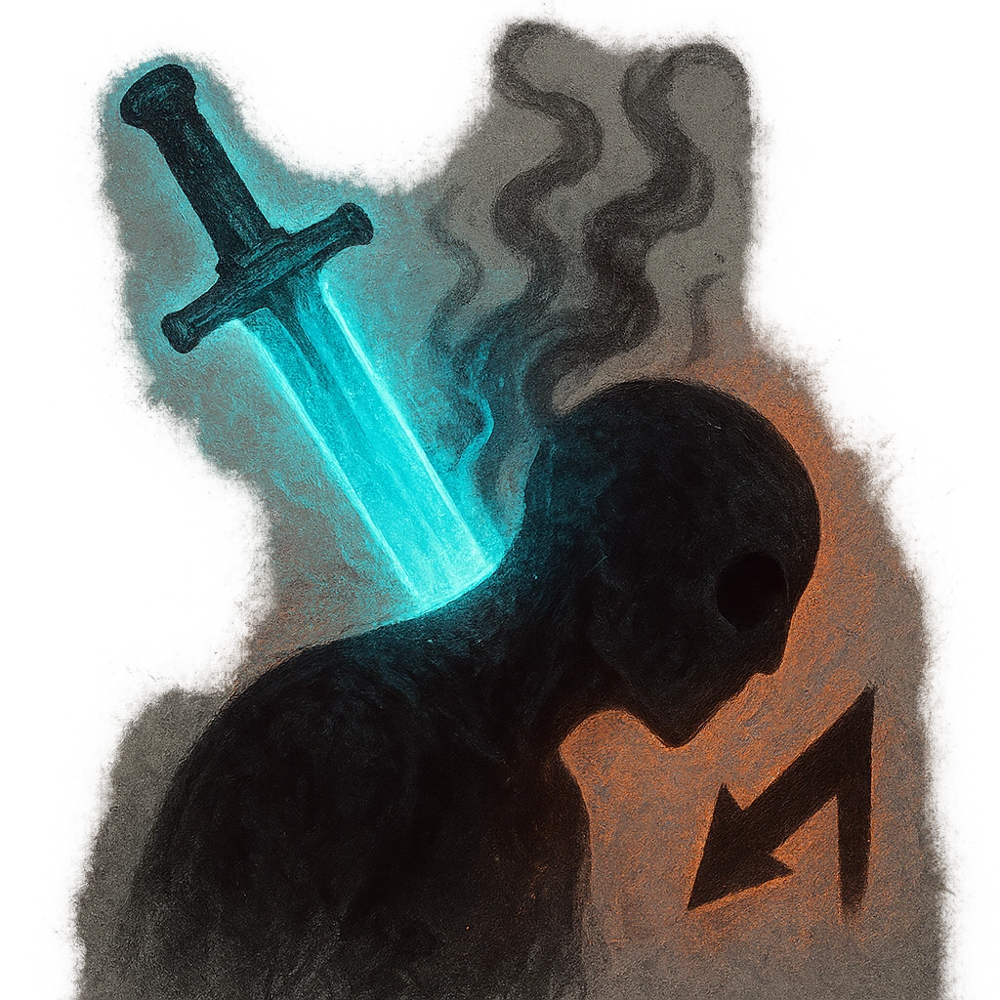

# Ghost Blade

## Description
*
<strong>Spend a Fear</strong> to make an attack against a target within Very Close range. On a success, deal <strong>2d10+6</strong> physical damage and the target must mark a Stress.
*

## Actions
- 
**Attack** *Spend a Fear to make an attack against a target within Very Close range. On a success, deal 2d10+6 physical damage and the target must mark a Stress.*

---

adversaries-features/Standard
 
**UUID:** `Compendium.cybermancy.system.ghost-blade`

