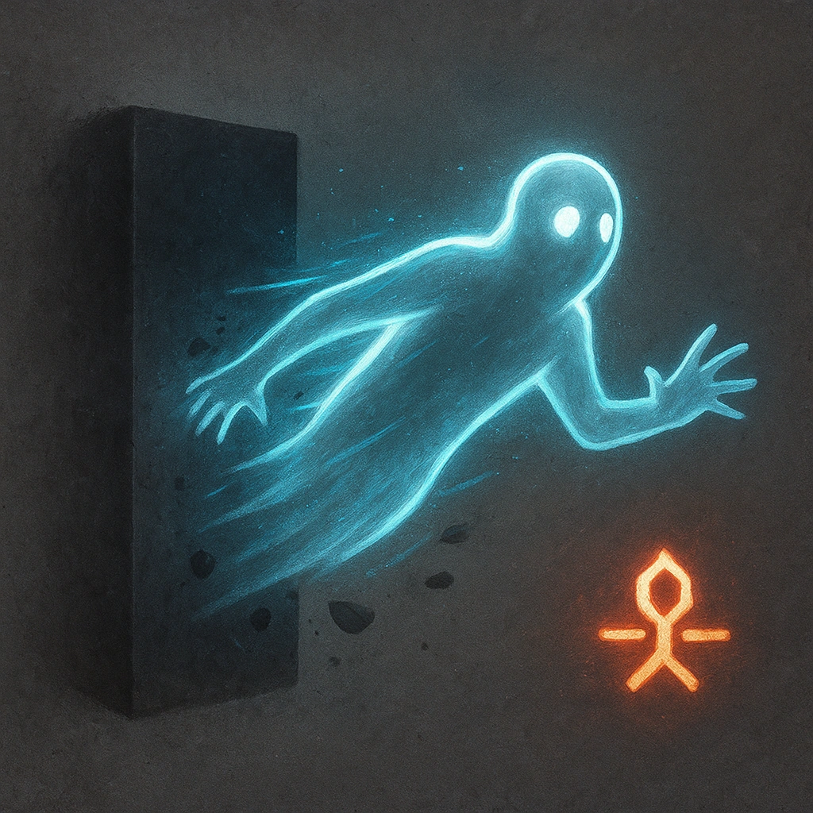

# Ghost

## Description
*
The Captain has resistance to physical damage. <strong>Mark a Stress</strong> to move up to Close range through solid objects.
*

## Actions
- 
**Mark Stress** *Mark a Stress to move up to Close range through solid objects.*

---

adversaries-features/Leader
 
**UUID:** `Compendium.cybermancy.system.ghost`

