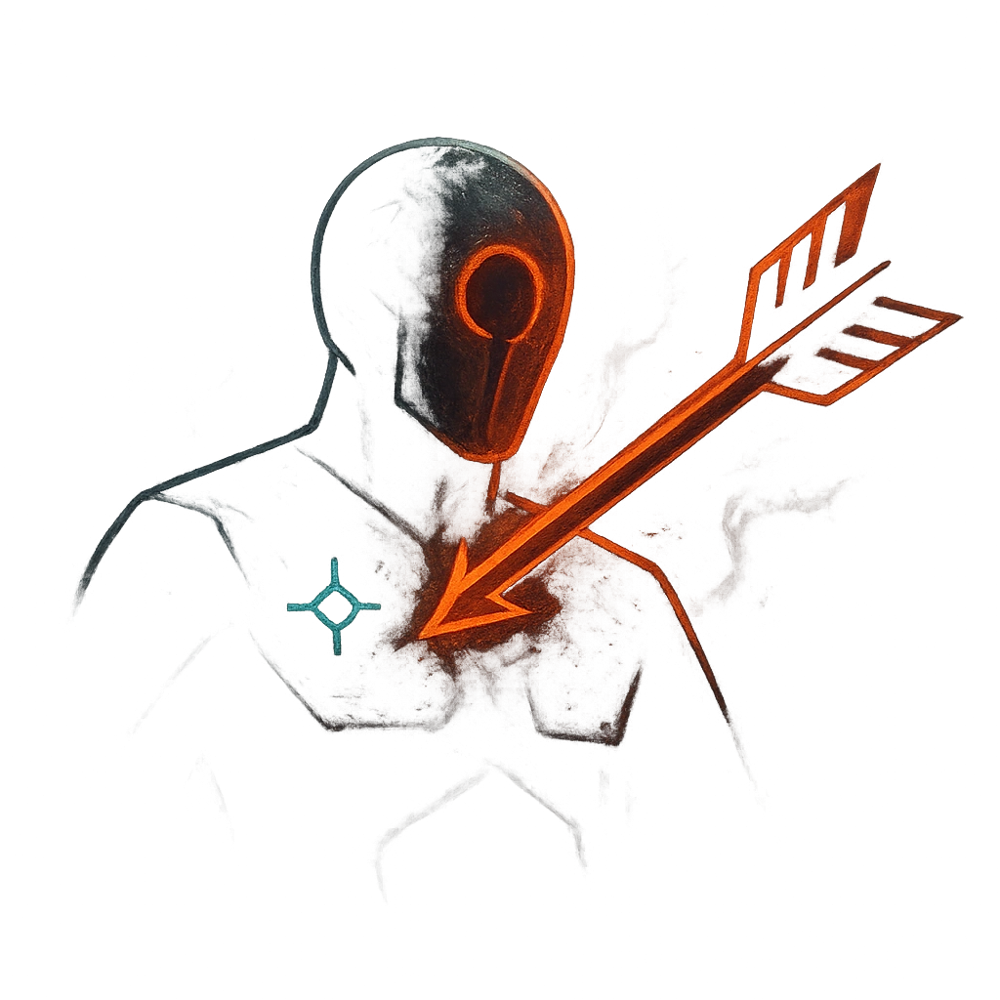

# Goading Strike

## Description
*
Make a standard attack against a target. On a success, <strong>mark a Stress</strong> to Taunt the target until their next successful attack. The next time the Taunted target attacks, they have disadvantage against targets other than the Weaponmaster.
*

## Actions
- 
**Attack** *Make a standard attack against a target. On a success, mark a Stress to Taunt the target until their next successful attack. The next time the Taunted target attacks, they have disadvantage against targets other than the Weaponmaster.*

---

adversaries-features/Bruiser
 
**UUID:** `Compendium.cybermancy.system.goading-strike`

