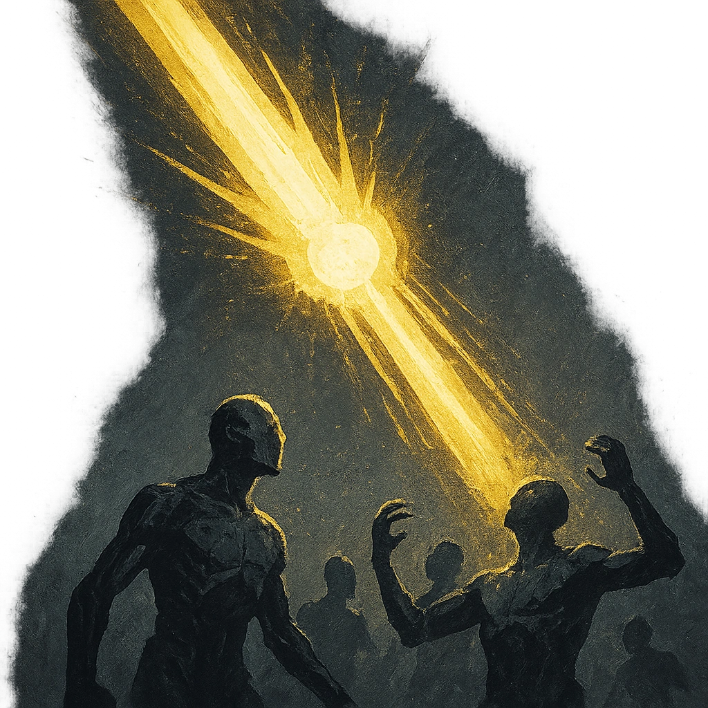

# God Rays

## Description
*
<strong>Mark a Stress</strong> to reflect a sliver of divinity as a searing beam of light that hits up to twenty targets within Very Far range. Targets must make a Presence Reaction Roll, with disadvantage if they are marked Guilty. Targets who fail take <strong>4d6+12</strong> magic damage. Targets who succeed take half damage.
*

## Actions
- 
**Roll Save** *Mark a Stress to reflect a sliver of divinity as a searing beam of light that hits up to twenty targets within Very Far range. Targets must make a Presence Reaction Roll, with disadvantage if they are marked Guilty. Targets who fail take 4d6+12 magic damage. Targets who succeed take half damage.*

---

adversaries-features/Leader
 
**UUID:** `Compendium.cybermancy.system.god-rays`

