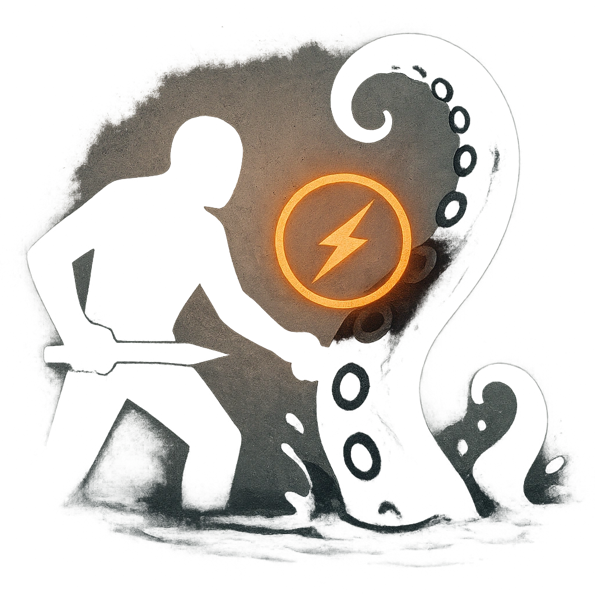

# Grapple and Drown

## Description
*
Make an attack roll against a target within Close range. On a success, <strong>mark a Stress</strong> to grab them with a tentacle and drag them beneath the water. The target is <em>Restrained</em> and <em>Vulnerable</em> until they break free with a successful Strength Roll or the Kraken takes Major or greater damage. While <em>Restrained</em> and <em>Vulnerable</em> in this way, a target must mark a Stress when they make an action roll.
*

## Actions
- 
**Attack** **

---

adversaries-features/Solo
 
**UUID:** `Compendium.cybermancy.system.grapple-and-drown`

