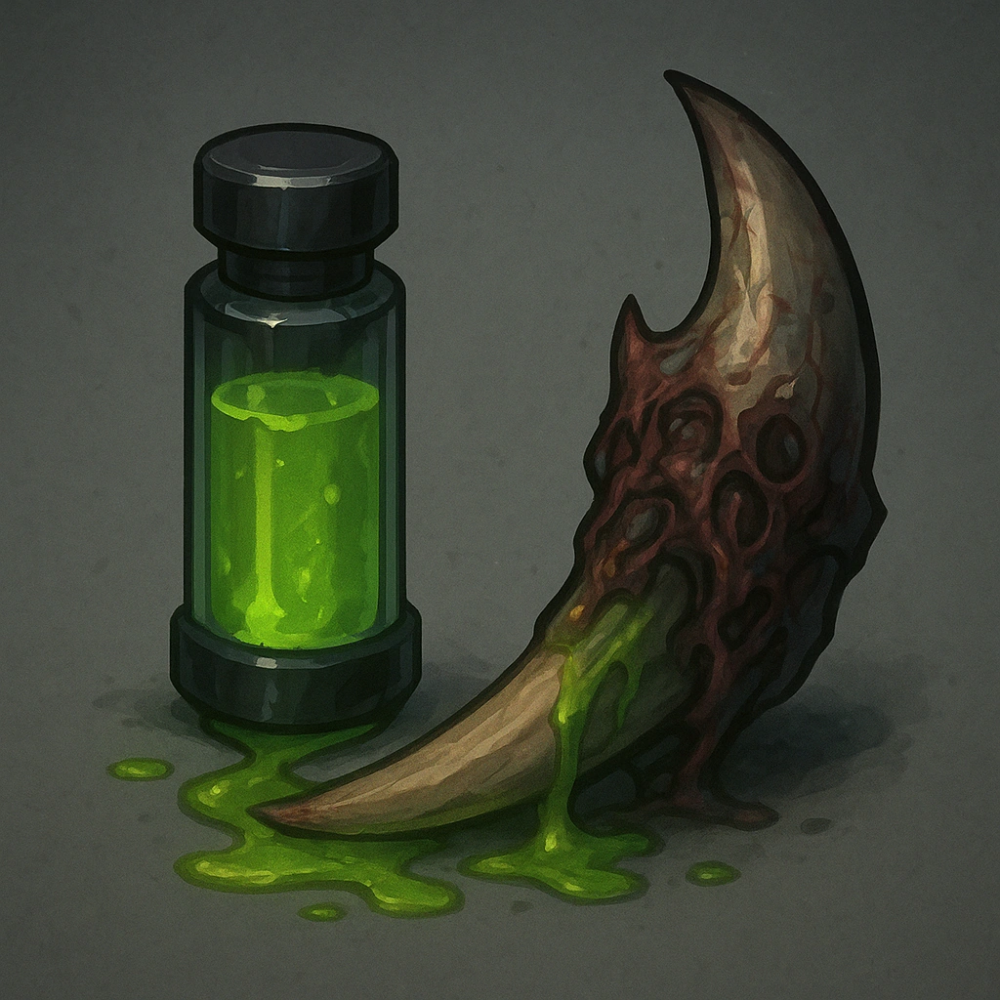

# Grindletooth Venom

## Description
*
Targets who mark HP from the Assassin’s attacks are Vulnerable until they clear a HP.
*

## Actions
- 
**Apply Venom** *Targets who mark HP from the Assassin’s attacks are Vulnerable until they clear a HP.*

---

adversaries-features/Skulk
 
**UUID:** `Compendium.cybermancy.system.grindletooth-venom`

