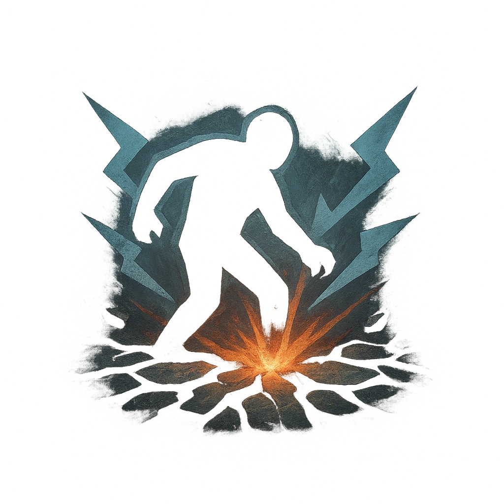

# Ground Slam

## Description
*
Slam the ground, knocking all targets within Very Close range back to Far range. Each target knocked back this way must mark a Stress.

@Template[type:emanation|range:vc]
*

## Actions
- 
**Stress Damage** *vc]*

---

adversaries-features/Bruiser
 
**UUID:** `Compendium.cybermancy.system.ground-slam`

