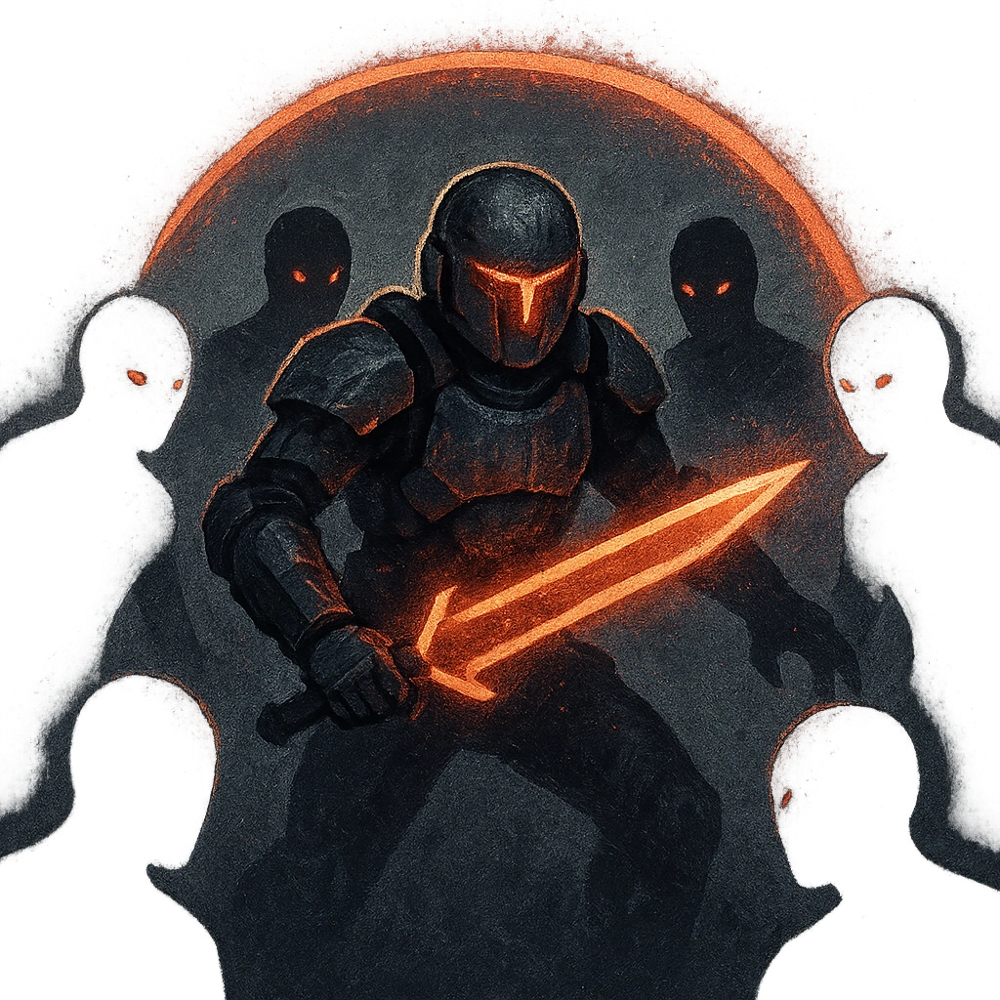

# Group Attack

## Description
*
<strong>Spend a Fear</strong> to choose a target and spotlight all Outer Realm Thralls within Close range of them. Those Minions move into Melee range of the target and make one shared attack roll. On a success, they deal 11 physical damage each. Combine this damage.
*

## Actions
- 
**Spend Fear** *Spend a Fear to choose a target and spotlight all Outer Realm Thralls within Close range of them. Those Minions move into Melee range of the target and make one shared attack roll. On a success, they deal 11 physical damage each. Combine this damage.*

---

adversaries-features/Minion
 
**UUID:** `Compendium.cybermancy.system.group-attack`

