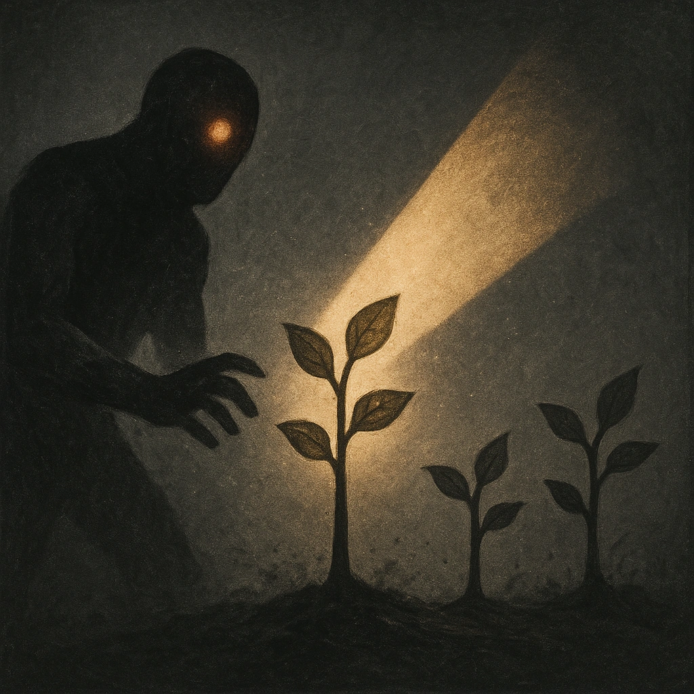

# Grow Saplings

## Description
*
<strong>Spend a Fear</strong> to grow three @UUID[Compendium.daggerheart.adversaries.Actor.o63nS0k3wHu6EgKP]{Treant Sapling Minions}, who appear at Close range and immediately take the spotlight.
*

## Actions
- 
**Spend Fear** *Spend a Fear to grow three @UUID[Compendium.daggerheart.adversaries.Actor.o63nS0k3wHu6EgKP]{Treant Sapling Minions}, who appear at Close range and immediately take the spotlight.*

---

adversaries-features/Leader
 
**UUID:** `Compendium.cybermancy.system.grow-saplings`

