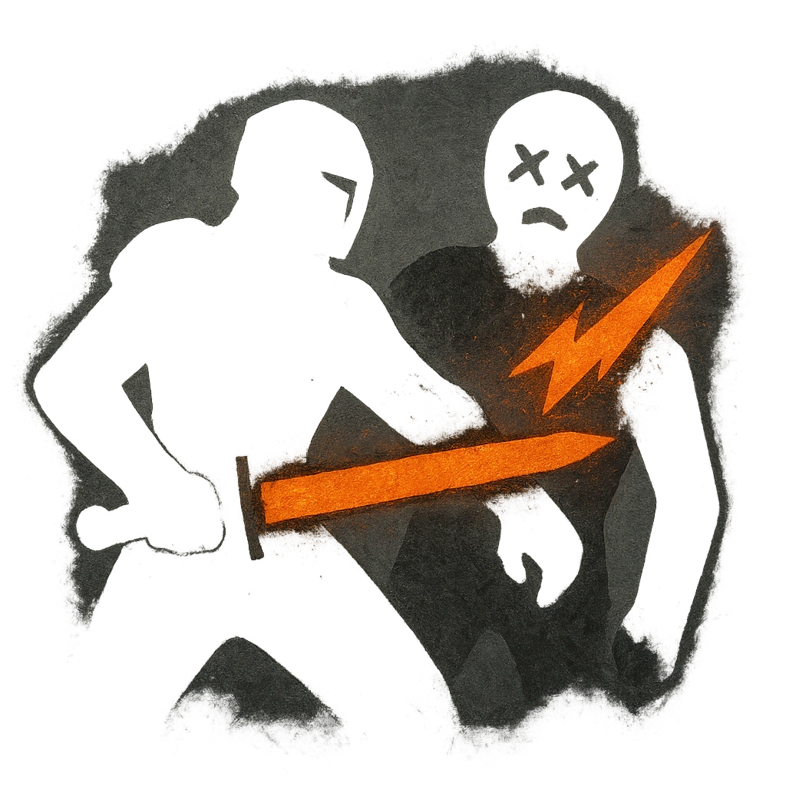

# Guardian

## Description
*
When an allied Vampire marks HP, you can <strong>mark a Stress</strong> to fly into Melee range of the attacker and make an attack with advantage against them. On a success, deal <strong>2d6+2</strong> physical damage.
*

## Actions
- 
**Mark Stress** *When an allied Vampire marks HP, you can mark a Stress to fl y into Melee range of the attacker and make an attack with advantage against them. On a success, deal 2d6+2 physical damage.*

---

adversaries-features/Skulk
 
**UUID:** `Compendium.cybermancy.system.guardian`

