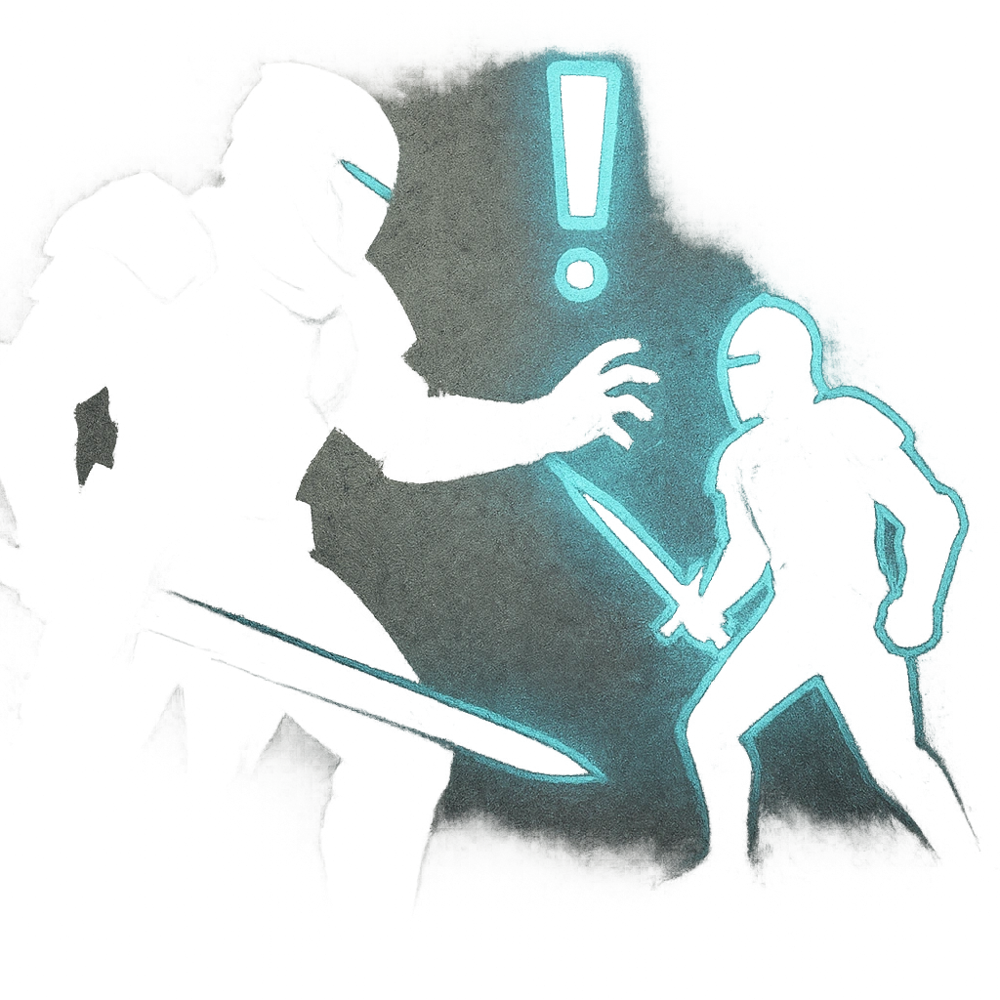

# Guards, Seize Them!

## Description
*
Once per scene, <strong>mark a Stress</strong> to summon <strong>1d4</strong> @UUID[Compendium.daggerheart.adversaries.Actor.B4LZcGuBAHzyVdzy]{Bladed Guards}, who appear at Far range to enforce the Noble’s will.
*

## Actions
- 
**Summon Guards** *Once per scene, mark a Stress to summon 1d4 @UUID[Compendium.daggerheart.adversaries.Actor.B4LZcGuBAHzyVdzy]{Bladed Guards}, who appear at Far range to enforce the Noble’s will.*

---

adversaries-features/Social
 
**UUID:** `Compendium.cybermancy.system.guards-seize-them`

