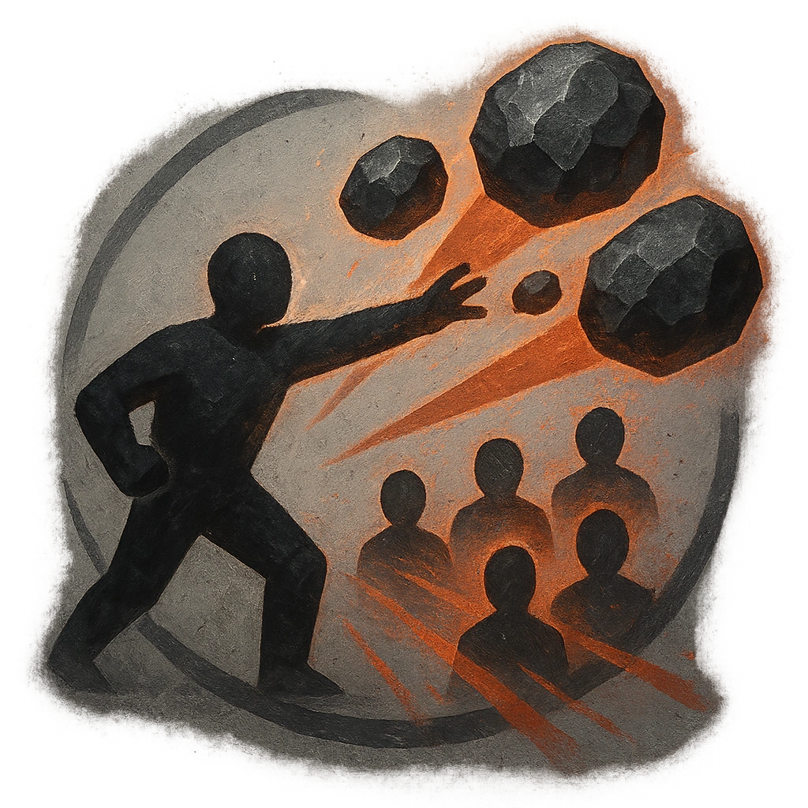

# Hail of Boulders

## Description
*
<strong>Mark a Stress</strong> to pick up heavy objects and throw them at all targets in front of the Ogre within Far range. Make an attack against these targets. Targets the Ogre succeeds against take <strong>1d10+2</strong> physical damage. If they succeed against more than one target, you gain a Fear.

@Template[type:inFront|range:f]
*

## Actions
- 
**Throw** *f]*

- 
**Gain Fear** **

---

adversaries-features/Solo
 
**UUID:** `Compendium.cybermancy.system.hail-of-boulders`

