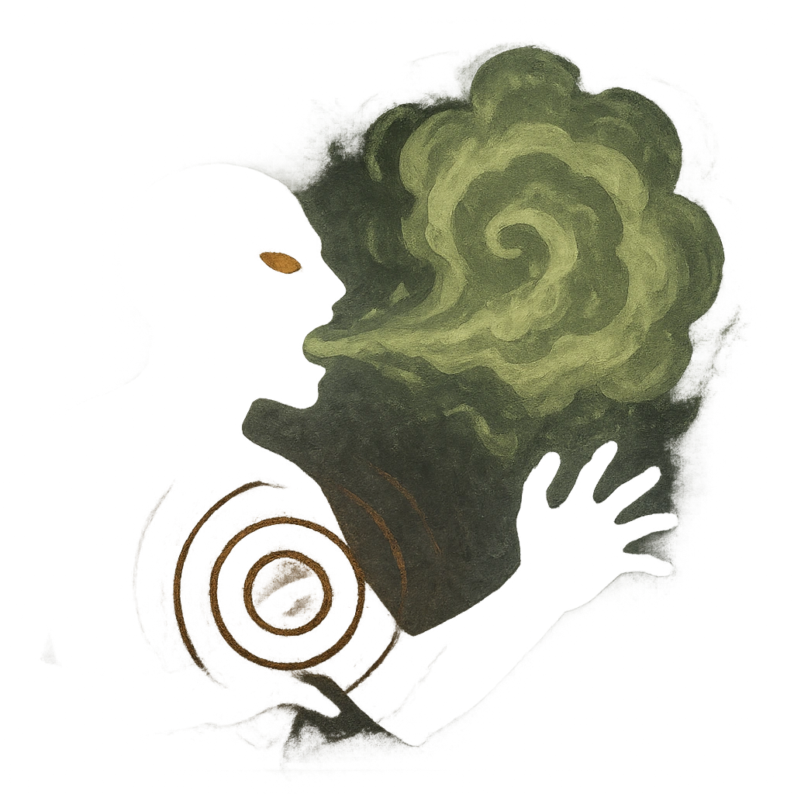

# Hallucinatory Breath

## Description
*
Countdown (Loop 1d6). When the Flickerfly takes damage for the first time, activate the countdown. When it triggers, the Flickerfly breathes hallucinatory gas on all targets in front of them up to Far range. Targets must make an Instinct Reaction Roll or be tormented by fearful hallucinations. Targets whose fears are known to the Flickerfl y have disadvantage on this roll. Targets who fail lose 2 Hope and take <strong>3d8+3</strong> direct magic damage.

@Template[type:inFront|range:f]
*

## Actions
- 
**Roll Save** *f]*

---

adversaries-features/Solo
 
**UUID:** `Compendium.cybermancy.system.hallucinatory-breath`

