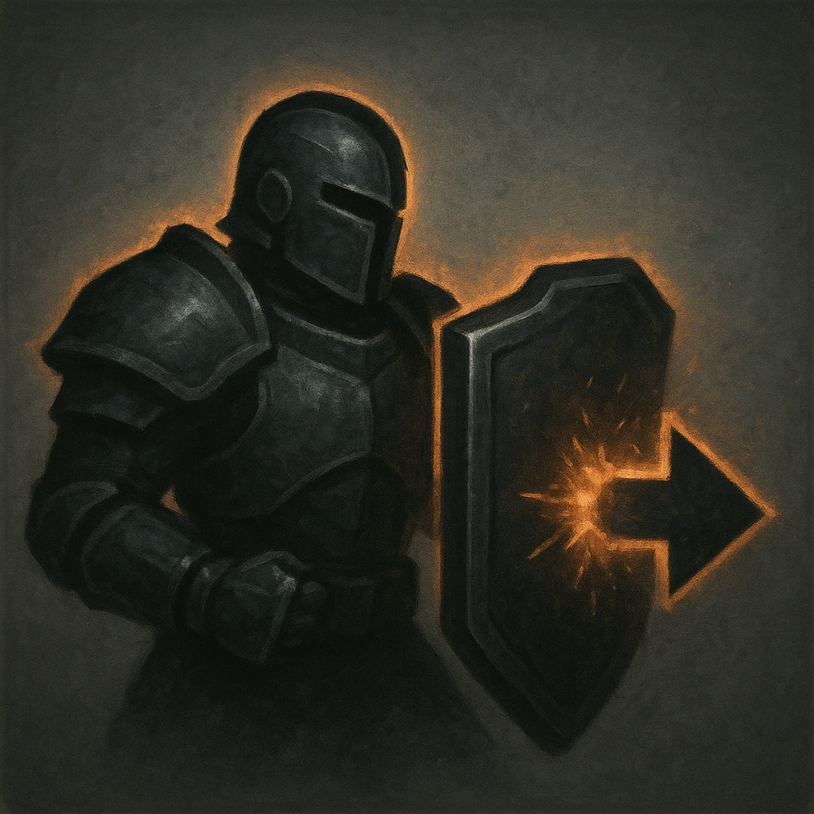

# Heavily Armored

## Description
*
 When the Knight takes physical damage, reduce it by 3.
*

## Actions
—

---

adversaries-features/Leader
 
**UUID:** `Compendium.cybermancy.system.heavily-armored`

