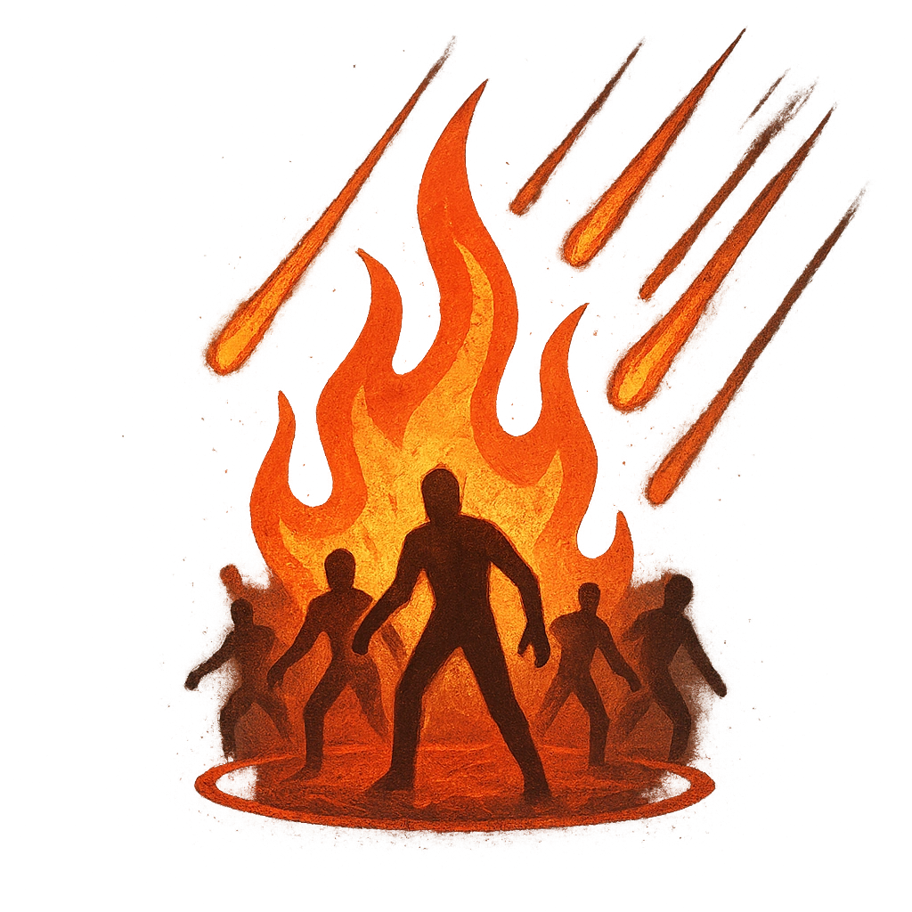

# Hellfire

## Description
*
<strong>Spend a Fear</strong> to rain down hellfire within Far range. All targets within the area must make an Agility Reaction Roll. Targets who fail take <strong>1d20+3</strong> magic damage. Targets who succeed take half damage.

@Template[type:emanation|range:f]
*

## Actions
- 
**Spend Fear** *f]*

---

adversaries-features/Solo
 
**UUID:** `Compendium.cybermancy.system.hellfire`

