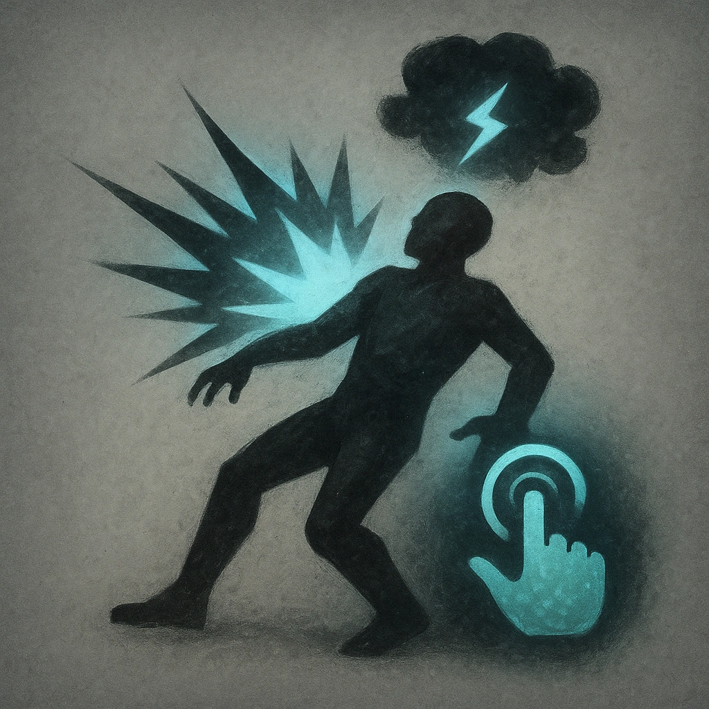

# High Tide

## Description
*
When the Elemental makes a successful standard attack, you can <strong>mark a Stress</strong> to knock the target back to Close range.
*

## Actions
- 
**Mark Stress** *When the Elemental makes a successful standard attack, you can mark a Stress to knock the target back to Close range.*

---

adversaries-features/Support
 
**UUID:** `Compendium.cybermancy.system.high-tide`

