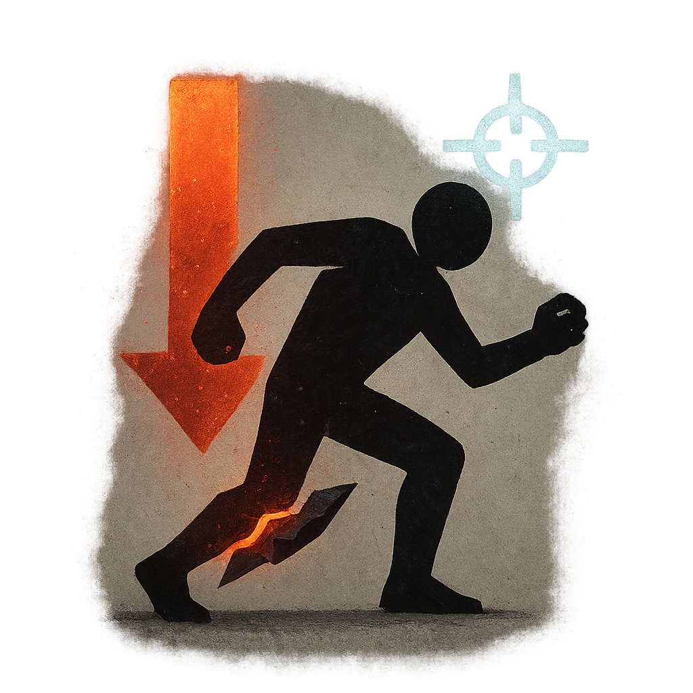

# Hobbling Strike

## Description
*
<strong>Mark a Stress</strong> to make an attack against a target within Melee range. On a success, deal <strong>3d4+10</strong> direct physical damage and make them <em>Vulnerable</em> until they clear at least 1 HP.
*

## Actions
- 
**Attack** *Mark a Stress to make an attack against a target within Melee range. On a success, deal 3d4+10 direct physical damage and make them Vulnerable until they clear at least 1 HP.*

---

adversaries-features/Skulk
 
**UUID:** `Compendium.cybermancy.system.hobbling-strike`

