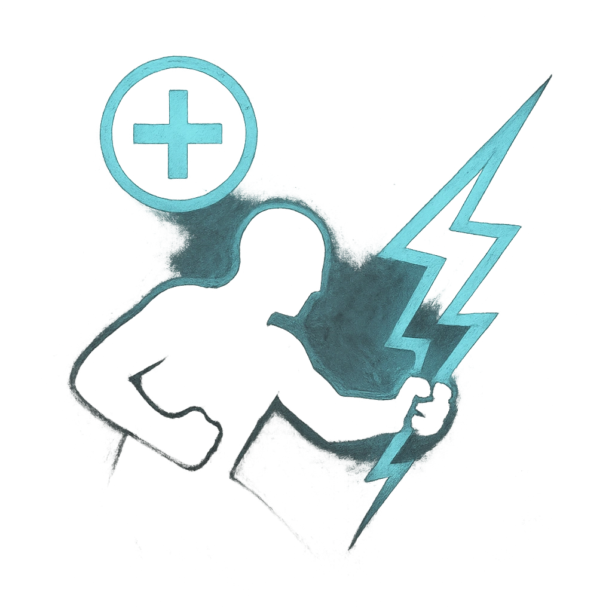

# Hold Fast

## Description
*
When the Captain’s Spectral allies are forced to make a reaction roll, you can <strong>mark a Stress</strong> to give those allies a +2 bonus to the roll.
*

## Actions
- 
**Mark Stress** *When the Captain’s Spectral allies are forced to make a reaction roll, you can mark a Stress to give those allies a +2 bonus to the roll.*

---

adversaries-features/Leader
 
**UUID:** `Compendium.cybermancy.system.hold-fast`

