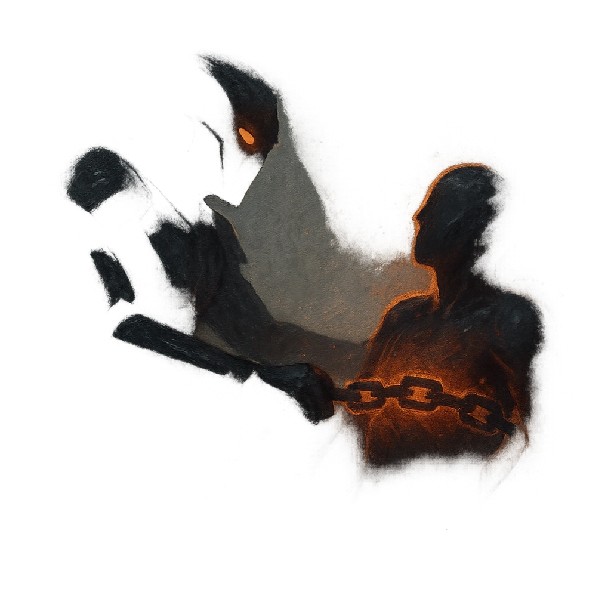

# Hold Them Down

## Description
*
Make an attack against a target within Melee range. On a success, the target takes no damage but is Restrained and <em>Vulnerable</em>. The target can break free, clearing both conditions, with a successful Strength Roll or is freed automatically if the Kneebreaker takes Major or greater damage.
*

## Actions
- 
**Attack** *Make an attack against a target within Melee range. On a success, the target takes no damage but is Restrained and Vulnerable. The target can break free, clearing both conditions, with a successful Strength Roll or is freed automatically if the Kneebreaker takes Major or greater damage.*

---

adversaries-features/Bruiser
 
**UUID:** `Compendium.cybermancy.system.hold-them-down`

