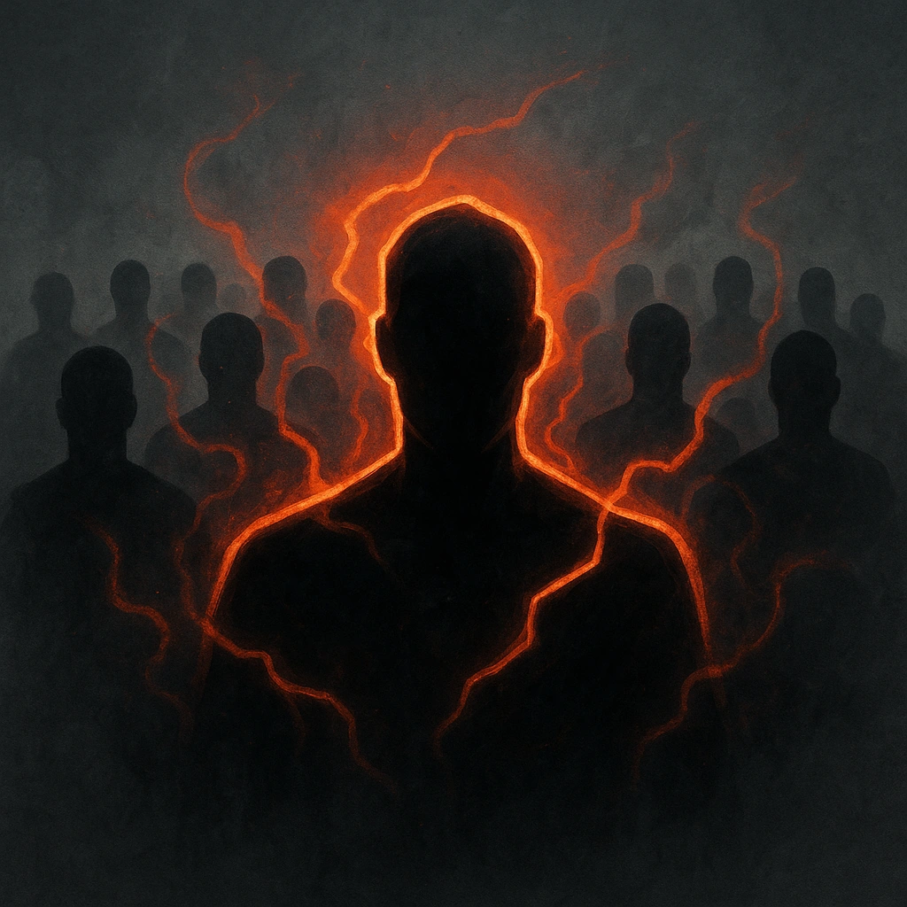

# Horde (1d4+2)

## Description
*
When the Zombies have marked half or more of their HP, their standard attack deals <strong>1d4+2</strong> physical damage instead.
*

## Actions
—

---

adversaries-features/Horde
 
**UUID:** `Compendium.cybermancy.system.horde-1d4-2`

