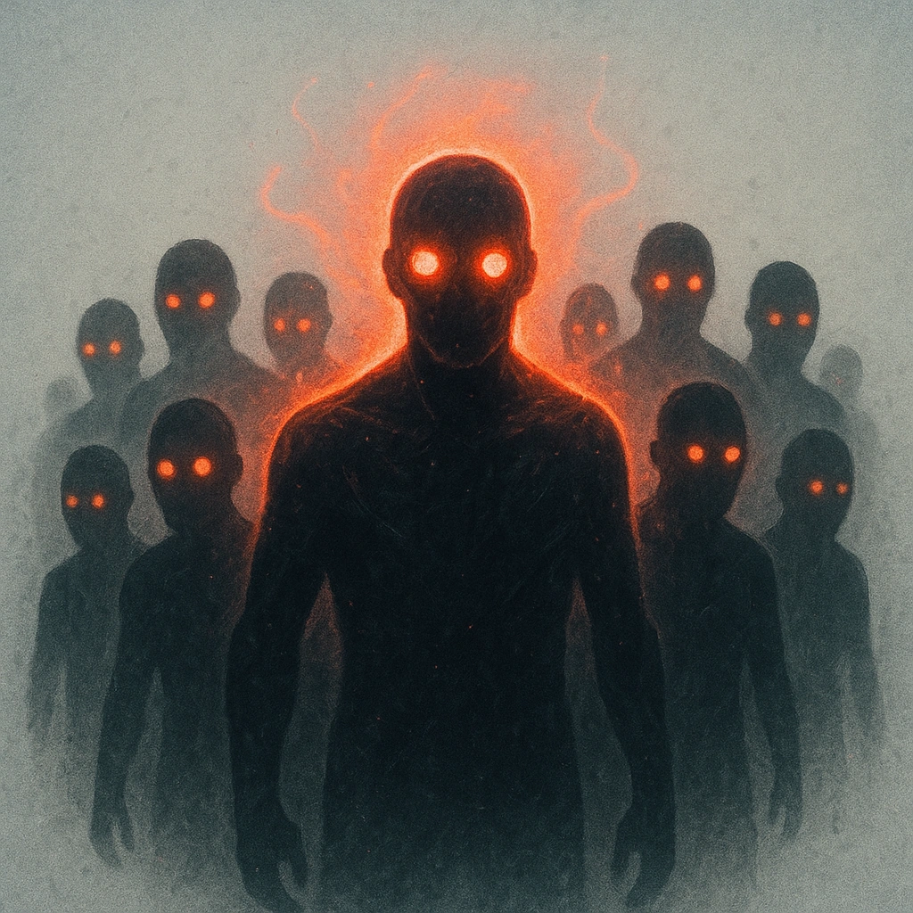

# Horde (1d6+3)

## Description
*
When the Squadron has marked half or more of their HP, their standard attack deals <strong>1d6+3</strong> physical damage instead.
*

## Actions
—

---

adversaries-features/Horde
 
**UUID:** `Compendium.cybermancy.system.horde-1d6-3`

