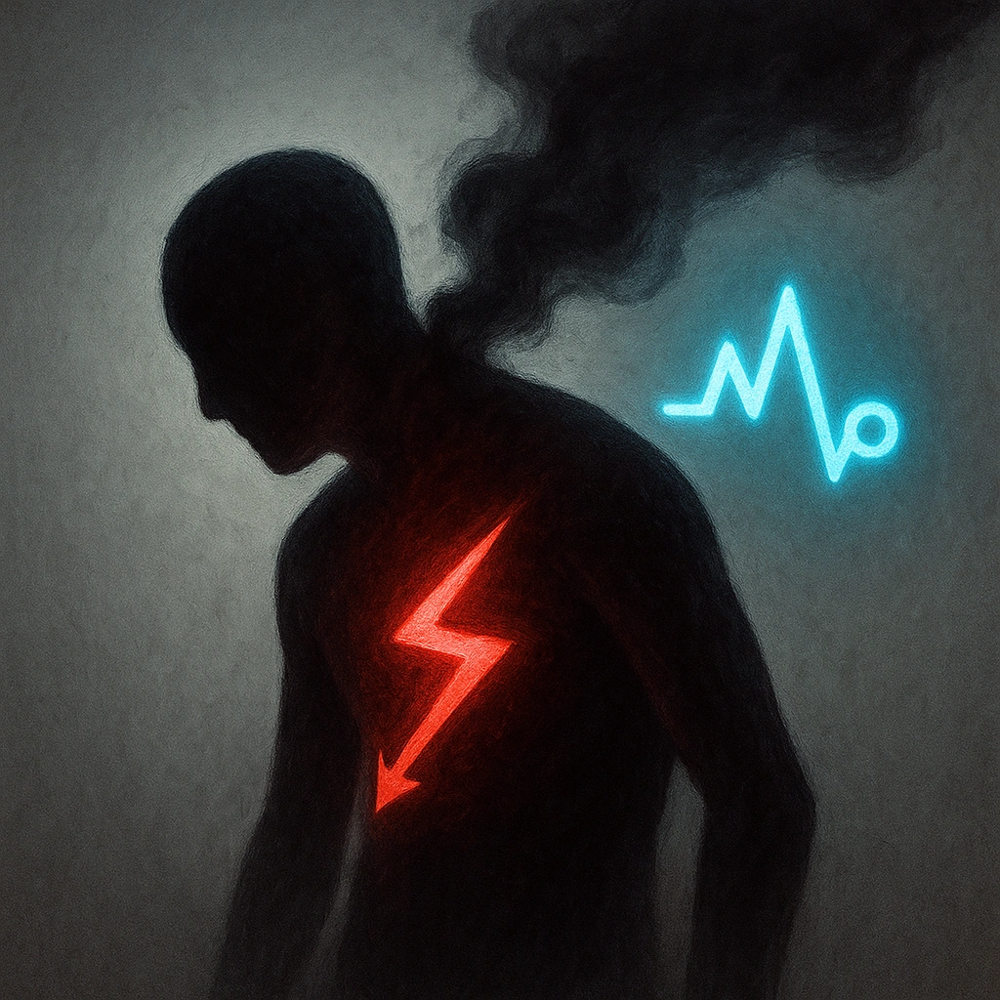

# Horrifying

## Description
*
Targets who mark HP from the Zombie’s attacks must also mark a Stress.
*

## Actions
- 
**Mark Stress** *Targets who mark HP from the Zombie’s attacks must also mark a Stress.*

---

adversaries-features/Standard
 
**UUID:** `Compendium.cybermancy.system.horrifying`

