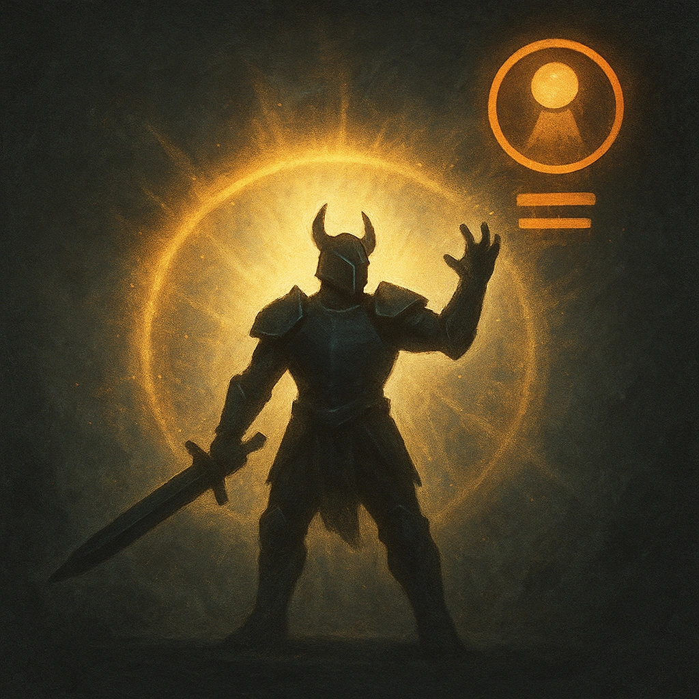

# I Have Never Known Defeat

## Description
*
When the Realm-Breaker marks their last HP, replace them with the @UUID[Compendium.daggerheart.adversaries.Actor.RXkZTwBRi4dJ3JE5]{Fallen Warlord: Undefeated Champion} and immediately spotlight them.
*

## Actions
—

---

adversaries-features/Solo
 
**UUID:** `Compendium.cybermancy.system.i-have-never-known-defeat`

