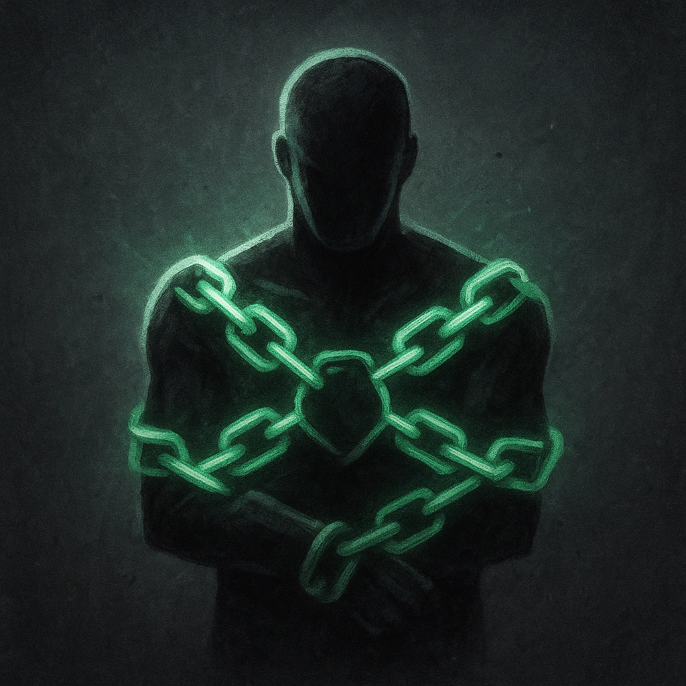

# I've Got 'Em

## Description
*
Creatures <em>Restrained</em> by the Kneebreaker take double damage from attacks by other adversaries.
*

## Actions
—

---

adversaries-features/Bruiser
 
**UUID:** `Compendium.cybermancy.system.i-ve-got-em`

