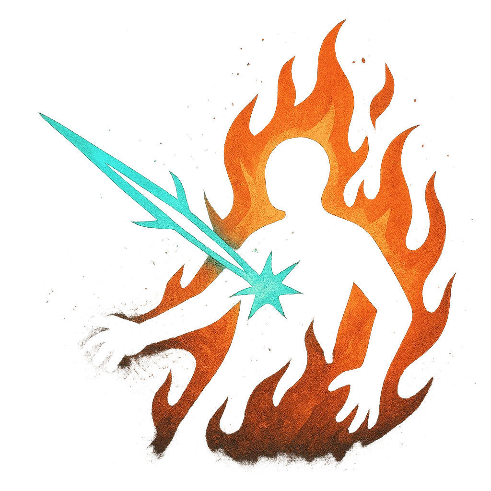

# Ignite

## Description
*
Make an attack against a target within Very Close range. On a success, the target takes <strong>1d8</strong> magic damage and is Ignited until they’re extinguished with a successful Finesse Roll (14). While Ignited, the target takes <strong>1d4</strong> magic damage when they make an action roll.
*

## Actions
- 
**Attack** *Make an attack against a target within Very Close range. On a success, the target takes 1d8 magic damage and is Ignited until they’re extinguished with a successful Finesse Roll (14). While Ignited, the target takes 1d4 magic damage when they make an action roll.*

- 
**Ignited Damage** *While Ignited, the target takes 1d4 magic damage when they make an action roll.*

---

adversaries-features/Skulk
 
**UUID:** `Compendium.cybermancy.system.ignite`

