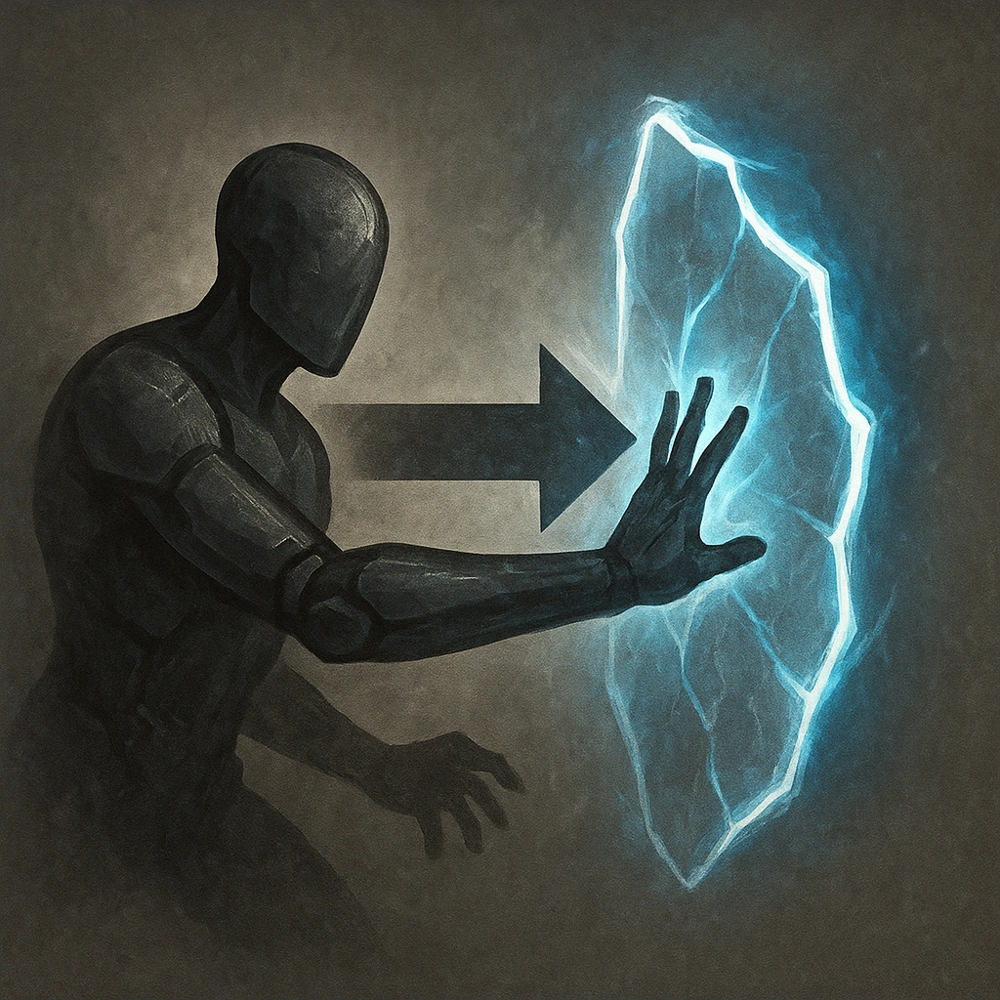

# Immovable Object

## Description
*
An attack that would move the Elemental moves them two fewer ranges (for example, Far becomes Very Close). When the Elemental takes physical damage, reduce it by 7.
*

## Actions
—

---

adversaries-features/Bruiser
 
**UUID:** `Compendium.cybermancy.system.immovable-object`

