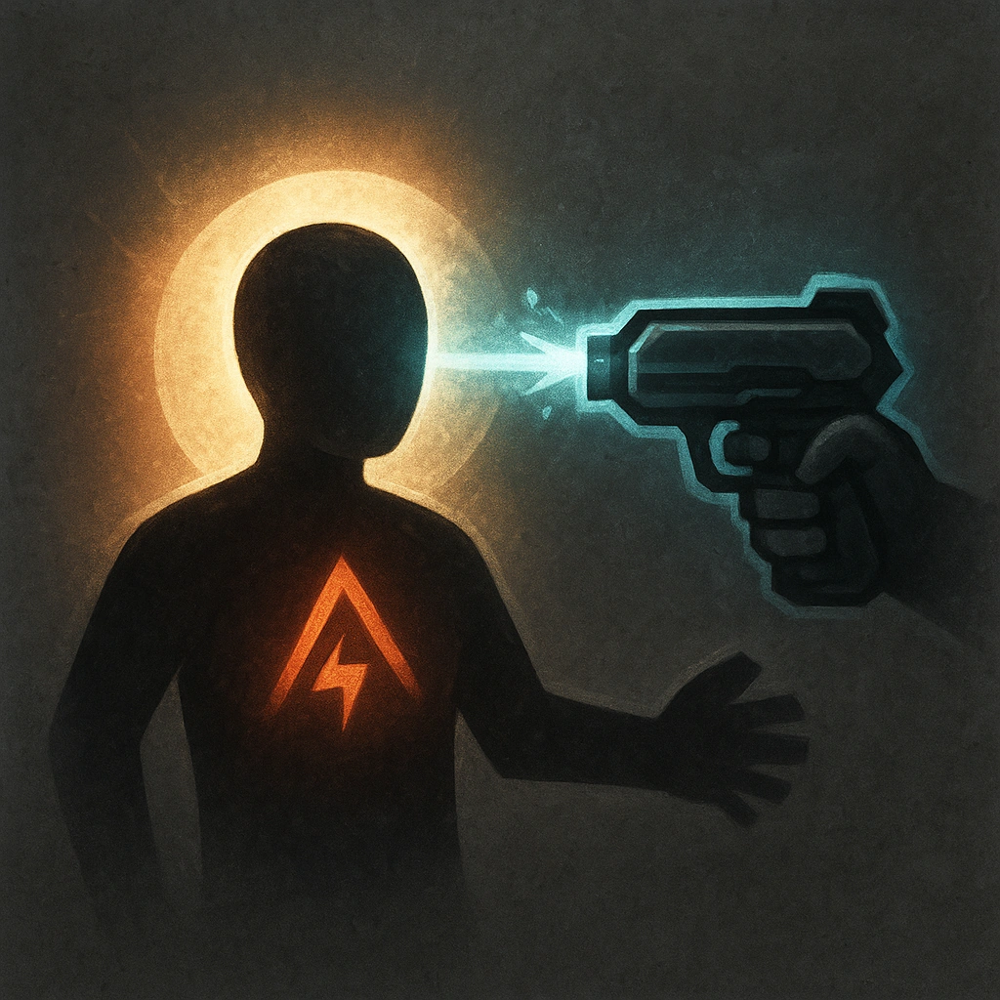

# Inevitable Death

## Description
*
<strong>Mark a Stress</strong> to spotlight <strong>1d4</strong> allies. Attacks they make while spotlighted in this way deal half damage.
*

## Actions
- 
**Spotlight Allies** *Mark a Stress to spotlight 1d4 allies. Attacks they make while spotlighted in this way deal half damage.*

---

adversaries-features/Leader
 
**UUID:** `Compendium.cybermancy.system.inevitable-death`

