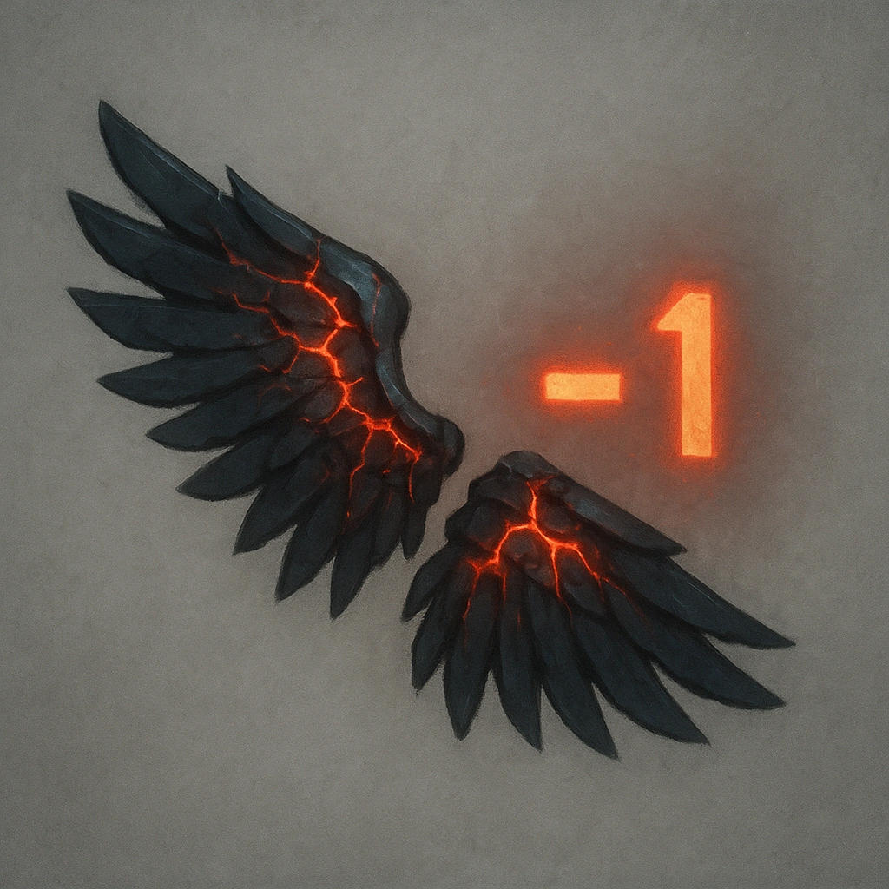

# Injured Wings

## Description
*
While flying, the Ashen Tyrant gains a +1 bonus to their Difficulty.
*

## Actions
—

---

adversaries-features/Solo
 
**UUID:** `Compendium.cybermancy.system.injured-wings`

